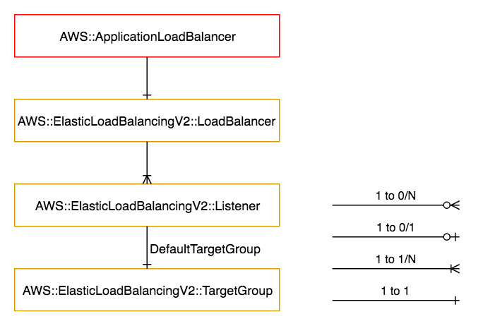

============================
AWS::ApplicationLoadBalancer
============================

Architectural Outcome
=====================

The consumable creates an Application Load Balancer, for use by other components, such as Serverless.

Note that a default target group is created but cannot be configured. Instead, the app should define its own target groups and appropriate rules.

Quick Start
===========

This example fronts 2 :doc:`serverless` consumables:

.. literalinclude:: ../samples/applicationloadbalancer-quickstart.yaml
  :language: yaml
  :caption: AWS::ApplicationLoadBalancer Quick Start

Resources
=========

Application Load Balancer
-------------------------

:Naming pattern: ``ApplicationLoadBalancer``
:Required: Yes
:Resource type: `AWS::ElasticLoadBalancingV2::LoadBalancer <https://docs.aws.amazon.com/AWSCloudFormation/latest/UserGuide/aws-resource-elasticloadbalancingv2-loadbalancer.html>`_

.. table:: Available Properties
    :widths: grid

    +----------+---------------+----------+
    | Property | Default Value | Comments |
    +==========+===============+==========+
    | Scheme   | internal      |          |
    +----------+---------------+----------+

Listener
--------

:Naming pattern: ``Listener``
:Required: Yes
:Resource type: `AWS::ElasticLoadBalancingV2::Listener <https://docs.aws.amazon.com/AWSCloudFormation/latest/UserGuide/aws-resource-elasticloadbalancingv2-listener.html>`_

.. table:: Available Properties
    :widths: grid

    +--------------+---------------+----------+
    | Property     | Default Value | Comments |
    +==============+===============+==========+
    | Certificates |               |          |
    +--------------+---------------+----------+
    | Port         |               | Required |
    +--------------+---------------+----------+
    | Protocol     |               | Required |
    +--------------+---------------+----------+

ListenerRule
------------

:Naming pattern: ``ListenerRule``
:Required: No
:Resource type: `AWS::ElasticLoadBalancingV2::ListenerRule <https://docs.aws.amazon.com/AWSCloudFormation/latest/UserGuide/aws-resource-elasticloadbalancingv2-listenerrule.html>`_

.. table:: Available Properties
    :widths: grid

    +-------------+---------------+------------------------------------------------+
    | Property    | Default Value | Comments                                       |
    +=============+===============+================================================+
    | Actions     |               | List of actions.                               |
    +-------------+---------------+------------------------------------------------+
    | Conditions  |               | List of conditions.                            |
    +-------------+---------------+------------------------------------------------+
    | ListenerArn |               | Ref to the listener defined in same component. |
    +-------------+---------------+------------------------------------------------+
    | Priority    |               | Must be unique, else deploy fails.             |
    +-------------+---------------+------------------------------------------------+

TargetGroup
------------

:Naming pattern: ``TargetGroup``
:Required: No
:Resource type: ``Custom::ALB-TargetGroup`` (see core-cfndelta)

.. table:: Available Properties
    :widths: grid

    +----------+---------------+-----------------------------------------------------------+
    | Property | Default Value | Comments                                                  |
    +==========+===============+===========================================================+
    | Name     |               |                                                           |
    +----------+---------------+-----------------------------------------------------------+
    | Targets  |               | List of Ids, use Fn::Pipeline::GetOutput. See quickstart. |
    +----------+---------------+-----------------------------------------------------------+
    | Protocol |               | Required                                                  |
    +----------+---------------+-----------------------------------------------------------+

Security
========

Security Rules
--------------

Add security rules to the ApplicationLoadBalancer resource to control the ingress to the load balancer.

Outputs
=======

+----------------------+----------------------------------------------+----------------------------------------------------------------------------------------------------------------------------------+
| Output Name          | Description                                  | Sample Value                                                                                                                     |
+======================+==============================================+==================================================================================================================================+
| Build                | Build number                                 | 2                                                                                                                                |
+----------------------+----------------------------------------------+----------------------------------------------------------------------------------------------------------------------------------+
| \*ListenerArn        | ARN of the listener. One output per listener | arn:aws:elasticloadbalancing:ap-southeast-1:138500934092:listener/app/demo-Appli-13MFVXQ71GCEZ/95e96d51488b11cf/d328acc899f73992 |
+----------------------+----------------------------------------------+----------------------------------------------------------------------------------------------------------------------------------+
| LoadBalancerArn      | ARN of the load balancer                     | arn:aws:elasticloadbalancing:ap-southeast-1:138500934092:loadbalancer/app/demo-Appli-13MFVXQ71GCEZ/95e96d51488b11cf              |
+----------------------+----------------------------------------------+----------------------------------------------------------------------------------------------------------------------------------+
| PrivateDeploymentDns | Private DNS record of the load balancer      | my-alb.master.app.demo.sin.auto.nonprod.c0.xyz.com                                                                               |
+----------------------+----------------------------------------------+----------------------------------------------------------------------------------------------------------------------------------+
| PublicDeploymentDns  | Public DNS record of the load balancer       | my-alb.master.app.demo.sin.auto.nonprod.pc0.xyz.com, or "none" if load balancer is internal-facing                               |
+----------------------+----------------------------------------------+----------------------------------------------------------------------------------------------------------------------------------+
