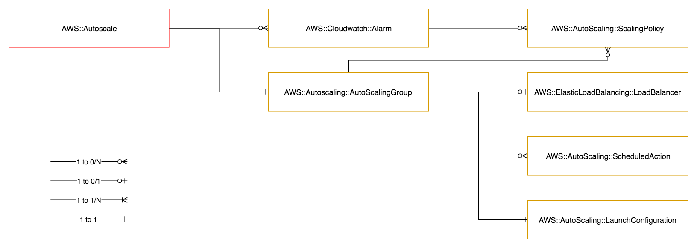

============
AWS::Cluster
============

Architectural Outcome
=====================

The component supports auto-scaling instances without a load balancer.

The resource is configured according to properties and default set out below.

Quick Start
===========

.. literalinclude:: ../samples/cluster-quickstart.yaml
  :language: yaml
  :caption: AWS::Cluster Quick Start

Resources
=========

Bake Instance
------------------

:Naming pattern: ``BakeInstance``
:Required: Yes
:Reference: `AWS::EC2::Instance <http://docs.aws.amazon.com/AWSCloudFormation/latest/UserGuide/aws-properties-ec2-instance.html>`_

This resource is used to configure the instance used to bake the application AMI. The configuration of this resource should therefore include any required application bootstrap actions.

.. table:: Available Properties
    :widths: grid

    +---------------------+---------------+----------------------------------------------------+
    | Property            | Default Value | Comments                                           |
    +=====================+===============+====================================================+
    | BlockDeviceMappings |               |                                                    |
    +---------------------+---------------+----------------------------------------------------+
    | ImageId             |               | Value must use the Fn::Pipeline::ImageId function  |
    +---------------------+---------------+----------------------------------------------------+
    | InstanceType        |               | Required                                           |
    +---------------------+---------------+----------------------------------------------------+
    | KeyName             |               | Key must exist                                     |
    +---------------------+---------------+----------------------------------------------------+
    | SubnetId            | private       | Value must use the Fn::Pipeline::SubnetId function |
    +---------------------+---------------+----------------------------------------------------+

.. table:: Available Top-Level Properties
    :widths: grid

    +---------------------------------------+---------------+----------+
    | Property                              | Default Value | Comments |
    +=======================================+===============+==========+
    | CreationPolicy.ResourceSignal.Timeout | PT15M         |          |
    +---------------------------------------+---------------+----------+
    | CreationPolicy.ResourceSignal.Count   | 1             |          |
    +---------------------------------------+---------------+----------+
    | Metadata                              |               |          |
    +---------------------------------------+---------------+----------+

Auto Scaling Group
------------------

:Naming pattern: ``AutoScalingGroup``
:Required: Yes
:Reference: `AWS::AutoScaling::AutoScalingGroup <http://docs.aws.amazon.com/AWSCloudFormation/latest/UserGuide/aws-properties-as-group.html>`_

All Auto Scaling Groups are created with all group metrics enabled. Metrics are collected at a frequency of 1 minute. This option cannot be changed.

See `ASG MetricsCollection <https://docs.aws.amazon.com/AWSCloudFormation/latest/UserGuide/aws-properties-as-group.html#cfn-as-group-metricscollection>`_.

.. table:: Available Properties
    :widths: grid

    +------------------------+---------------+-----------------------------------------------------------------------------------------------------------------------------------------------------------+
    | Property               | Default Value | Comments                                                                                                                                                  |
    +========================+===============+===========================================================================================================================================================+
    | Cooldown               |               |                                                                                                                                                           |
    +------------------------+---------------+-----------------------------------------------------------------------------------------------------------------------------------------------------------+
    | DesiredCapacity        |               |                                                                                                                                                           |
    +------------------------+---------------+-----------------------------------------------------------------------------------------------------------------------------------------------------------+
    | HealthCheckGracePeriod | 300           |                                                                                                                                                           |
    +------------------------+---------------+-----------------------------------------------------------------------------------------------------------------------------------------------------------+
    | MinSize                |               | Required                                                                                                                                                  |
    +------------------------+---------------+-----------------------------------------------------------------------------------------------------------------------------------------------------------+
    | MaxSize                |               | Required                                                                                                                                                  |
    +------------------------+---------------+-----------------------------------------------------------------------------------------------------------------------------------------------------------+
    | VPCZoneIdentifier      | private       | Alias ("public", "private") driven by LoadBalancer.Scheme or private if no LoadBalancer.                                                                  |
    +------------------------+---------------+-----------------------------------------------------------------------------------------------------------------------------------------------------------+

.. table:: Available Top-Level Properties
    :widths: grid

    +------------------------------------------------------------------------+---------------+-----------------------------------------------------------------------------------------------------------------------------------------+
    | Property                                                               | Default Value | Comments                                                                                                                                |
    +========================================================================+===============+=========================================================================================================================================+
    | CreationPolicy.AutoScalingCreationPolicy.MinSuccessfulInstancesPercent | 100           | Controlled in facts, defaults to 100 percent (a sign of a well-architected app). ALL apps should avoid using this. Manage by exception. |
    +------------------------------------------------------------------------+---------------+-----------------------------------------------------------------------------------------------------------------------------------------+
    | CreationPolicy.ResourceSignal.Timeout                                  | PT15M         |                                                                                                                                         |
    +------------------------------------------------------------------------+---------------+-----------------------------------------------------------------------------------------------------------------------------------------+
    | CreationPolicy.ResourceSignal.Count                                    | MinSize\*     |                                                                                                                                         |
    +------------------------------------------------------------------------+---------------+-----------------------------------------------------------------------------------------------------------------------------------------+
    | Metadata                                                               |               |                                                                                                                                         |
    +------------------------------------------------------------------------+---------------+-----------------------------------------------------------------------------------------------------------------------------------------+

* Note: CreationPolicy.ResourceSignal.Count default value is taken from AutoScalingGroup MinSize Property.

Launch Configuration
--------------------

:Naming pattern: ``LaunchConfiguration``
:Required: Yes
:Reference: `AWS::AutoScaling::LaunchConfiguration <http://docs.aws.amazon.com/AWSCloudFormation/latest/UserGuide/aws-properties-as-launchconfig.html>`_

.. table:: Available Properties
    :widths: grid

    +---------------------+---------------+------------------------------------+
    | Property            | Default Value | Comments                           |
    +=====================+===============+====================================+
    | BlockDeviceMappings |               |                                    |
    +---------------------+---------------+------------------------------------+
    | EbsOptimized        | false         |                                    |
    +---------------------+---------------+------------------------------------+
    | InstanceType        |               | Required                           |
    +---------------------+---------------+------------------------------------+
    | KeyName             |               | Key must exist prior to deployment |
    +---------------------+---------------+------------------------------------+

Scaling Policies
----------------

:Naming pattern: ``*ScalingPolicy``
:Required: No
:Reference: `AWS::AutoScaling::ScalingPolicy <http://docs.aws.amazon.com/AWSCloudFormation/latest/UserGuide/aws-properties-as-policy.html>`_

.. table:: Available Properties
    :widths: grid

    +-----------------------+---------------+----------------------------------------------------------+
    | Property              | Default Value | Comments                                                 |
    +=======================+===============+==========================================================+
    | Cooldown              |               | Not configurable if PolicyType is set to ``StepScaling`` |
    +-----------------------+---------------+----------------------------------------------------------+
    | MetricAggregationType |               |                                                          |
    +-----------------------+---------------+----------------------------------------------------------+
    | PolicyType            | SimpleScaling |                                                          |
    +-----------------------+---------------+----------------------------------------------------------+
    | ScalingAdjustment     |               | Required if PolicyType is set to ``SimpleScaling``       |
    +-----------------------+---------------+----------------------------------------------------------+
    | StepAdjustments       |               | Required if PolicyType is set to ``StepScaling``         |
    +-----------------------+---------------+----------------------------------------------------------+

Scheduled Actions
-----------------

:Naming pattern: ``*ScheduledAction``
:Required: No
:Reference: `AWS::AutoScaling::ScheduledAction <http://docs.aws.amazon.com/AWSCloudFormation/latest/UserGuide/aws-resource-as-scheduledaction.html>`_

.. table:: Available Properties
    :widths: grid

    +-----------------+---------------+----------+
    | Property        | Default Value | Comments |
    +=================+===============+==========+
    | DesiredCapacity |               |          |
    +-----------------+---------------+----------+
    | MaxSize         |               |          |
    +-----------------+---------------+----------+
    | MinSize         |               |          |
    +-----------------+---------------+----------+
    | Recurrence      |               |          |
    +-----------------+---------------+----------+

Alarms
------

:Naming pattern: ``*Alarm``
:Required: No
:Reference: `AWS::CloudWatch::Alarm <http://docs.aws.amazon.com/AWSCloudFormation/latest/UserGuide/aws-properties-cw-alarm.html>`_

.. table:: Available Properties
    :widths: grid

    +--------------------+----------------------------+---------------------+
    | Property           | Default Value              | Comments            |
    +====================+============================+=====================+
    | AlarmActions       |                            | Required            |
    +--------------------+----------------------------+---------------------+
    | ComparisonOperator |                            | Required            |
    +--------------------+----------------------------+---------------------+
    | Dimensions         | Points to AutoScalingGroup | Array of Dimensions |
    +--------------------+----------------------------+---------------------+
    | EvaluationPeriods  | 3                          |                     |
    +--------------------+----------------------------+---------------------+
    | MetricName         | CPUUtilization             |                     |
    +--------------------+----------------------------+---------------------+
    | Namespace          | AWS/EC2                    |                     |
    +--------------------+----------------------------+---------------------+
    | Period             | 60                         |                     |
    +--------------------+----------------------------+---------------------+
    | Statistic          | Average                    |                     |
    +--------------------+----------------------------+---------------------+
    | Threshold          |                            | Required            |
    +--------------------+----------------------------+---------------------+

Log Group Metric Alarms
-----------------------

:Naming pattern: ``*LogGroupMetricAlarm``
:Required: No
:Reference: `AWS::CloudWatch::Alarm <http://docs.aws.amazon.com/AWSCloudFormation/latest/UserGuide/aws-properties-cw-alarm.html>`_

This resource is the same as the Alarm resource, except that it automatically configured to use the Log Group Metric Filter namespace. This allows alarms to be triggered on the contents of the log group through the use of log group metric filters.

.. table:: Available Properties
    :widths: grid

    +--------------------+----------------------------+---------------------+
    | Property           | Default Value              | Comments            |
    +====================+============================+=====================+
    | AlarmActions       |                            | Required            |
    +--------------------+----------------------------+---------------------+
    | ComparisonOperator |                            | Required            |
    +--------------------+----------------------------+---------------------+
    | Dimensions         | Points to AutoScalingGroup | Array of Dimensions |
    +--------------------+----------------------------+---------------------+
    | EvaluationPeriods  | 3                          |                     |
    +--------------------+----------------------------+---------------------+
    | MetricName         | CPUUtilization             |                     |
    +--------------------+----------------------------+---------------------+
    | Period             | 60                         |                     |
    +--------------------+----------------------------+---------------------+
    | Statistic          | Average                    |                     |
    +--------------------+----------------------------+---------------------+
    | Threshold          |                            | Required            |
    +--------------------+----------------------------+---------------------+

Log Group
---------

:Naming pattern: ``LogGroup``
:Required: No
:Reference: `AWS::Logs::LogGroup <https://docs.aws.amazon.com/AWSCloudFormation/latest/UserGuide/aws-resource-logs-loggroup.html>`_

.. table:: Available Properties
    :widths: grid

    +-----------------+---------------+----------+
    | Property        | Default Value | Comments |
    +=================+===============+==========+
    | RetentionInDays | 14            | Optional |
    +-----------------+---------------+----------+

Log Group Metric Filter
-----------------------

:Naming pattern: ``*LogGroupMetricFilter``
:Required: No
:Reference: `AWS::Logs::MetricFilter <https://docs.aws.amazon.com/AWSCloudFormation/latest/UserGuide/aws-resource-logs-metricfilter.html>`_

.. table:: Available Properties
    :widths: grid

    +-----------------------+----------------------------+---------------------+
    | Property              | Default Value              | Comments            |
    +=======================+============================+=====================+
    | FilterPattern         |                            | Required            |
    +-----------------------+----------------------------+---------------------+
    | MetricTransformations |                            | Required            |
    +-----------------------+----------------------------+---------------------+

Security
========

Encryption
----------

All EBS BlockDeviceMappings are created with storage encryption enabled. This option cannot be changed.

See `Amazon EBS Encryption <https://docs.aws.amazon.com/AWSEC2/latest/UserGuide/EBSEncryption.html>`_.

Security Rules
--------------

Set the pipeline security on the autoscalng group.

Outputs
=======

+----------------------+---------------------------------------------------------+--------------+
| Output Name          | Description                                             | Sample Value |
+======================+=========================================================+==============+
| Build                | Build number                                            | 2            |
+----------------------+---------------------------------------------------------+--------------+
| LoadBalancerName     | Name of load balancer                                   | <To do>      |
+----------------------+---------------------------------------------------------+--------------+
| PrivateDeploymentDns | Private DNS name of deployed component (build-specific) | <To do>      |
+----------------------+---------------------------------------------------------+--------------+
| PublicDeploymentDns  | Public DNS name of deployed component (build-specific)  | <To do>      |
+----------------------+---------------------------------------------------------+--------------+
