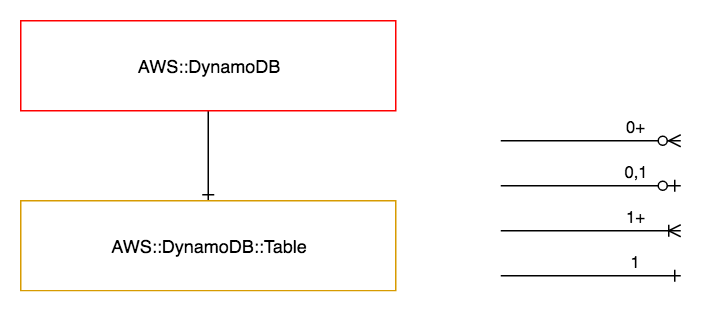

=============
AWS::DynamoDB
=============

Architectural Outcome
=====================

The component launches a DynamoDB table.  The resource is configured according to properties and default set out below.

Quick Start
===========

.. literalinclude:: ../samples/dynamodb-quickstart.yaml
  :language: yaml
  :caption: AWS::DynamoDB Quick Start

Resources
=========

Table
-----

:Naming pattern: ``Table``
:Required: Yes
:Reference: `AWS::DynamoDB::Table <https://docs.aws.amazon.com/AWSCloudFormation/latest/UserGuide/aws-resource-dynamodb-table.html>`_

.. table:: Available Properties
    :widths: grid

    +-------------------------+---------------+--------------------------------------+
    | Property                | Default Value | Comments                             |
    +=========================+===============+======================================+
    | AttributeDefinitions    |               | Required                             |
    +-------------------------+---------------+--------------------------------------+
    | BillingMode             | PROVISIONED   | PROVISIONED, PAY_PER_REQUEST         |
    +-------------------------+---------------+--------------------------------------+
    | GlobalSecondaryIndexes  |               |                                      |
    +-------------------------+---------------+--------------------------------------+
    | KeySchema               |               | Required                             |
    +-------------------------+---------------+--------------------------------------+
    | LocalSecondaryIndexes   |               |                                      |
    +-------------------------+---------------+--------------------------------------+
    | ProvisionedThroughput   |               | Required for provisioned BillingMode |
    +-------------------------+---------------+--------------------------------------+
    | StreamSpecification     |               |                                      |
    +-------------------------+---------------+--------------------------------------+
    | TimeToLiveSpecification |               |                                      |
    +-------------------------+---------------+--------------------------------------+

Security
========

Security rules
--------------

+-----------------+---------------------------+
| Allow Rule Name | Included Actions          |
+=================+===========================+
| read            | - dynamodb:BatchGetItem   |
|                 | - dynamodb:Describe*      |
|                 | - dynamodb:GetItem        |
|                 | - dynamodb:Query          |
|                 | - dynamodb:Scan           |
+-----------------+---------------------------+
| write           | - dynamodb:BatchWriteItem |
|                 | - dynamodb:PutItem        |
|                 | - dynamodb:UpdateItem     |
+-----------------+---------------------------+
| delete          | - dynamodb:DeleteItem     |
+-----------------+---------------------------+

Encryption
----------

DynamoDB tables are created with server-side encryption at rest enabled. See `Amazon DynamoDB Encryption at Rest <https://docs.aws.amazon.com/amazondynamodb/latest/developerguide/EncryptionAtRest.html>`_.

Outputs
=======

+------------------------+------------------------------+----------------------------------------------------------------------------------------------------------------+
| Output                 | Description                  | Example Value                                                                                                  |
+========================+==============================+================================================================================================================+
| Build                  | Build number                 | 1                                                                                                              |
+------------------------+------------------------------+----------------------------------------------------------------------------------------------------------------+
| StreamArn              | ARN of the stream            | arn:aws:dynamodb:ap-southeast-1:138500934092:table/demo-canary-testing-1-dynamo/stream/2018-04-24T08:51:38.289 |
+------------------------+------------------------------+----------------------------------------------------------------------------------------------------------------+
| StreamArnDeploymentDns | Deployment DNS of the stream | stream-dynamo.testing-1.canary.demo.sin.auto.nonprod.c0.xyz.com                                                |
+------------------------+------------------------------+----------------------------------------------------------------------------------------------------------------+
| TableArn               | ARN of the table             | arn:aws:dynamodb:ap-southeast-1:138500934092:table/demo-canary-testing-1-dynamo                                |
+------------------------+------------------------------+----------------------------------------------------------------------------------------------------------------+
| TableArnDeploymentDns  | Deployment DNS of the table  | dynamo.testing-1.canary.demo.sin.auto.nonprod.c0.xyz.com                                                       |
+------------------------+------------------------------+----------------------------------------------------------------------------------------------------------------+

Examples
========

Pay Per Request Mode
--------------------

.. literalinclude:: ../samples/dynamodb-payperrequest.yaml
  :language: yaml
  :caption: AWS::DynamoDB Pay Per Request Mode
