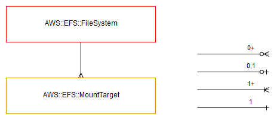

========
AWS::EFS
========

Architectural Outcome
=====================

This component launches an AWS EFS FileSystem and 1-3 MountTargets, based on ``AzCount`` in Facts.

The resource is configured according to properties and default set out below.

FileSystem
----------

:Naming pattern: ``FileSystem``
:Required: Yes
:Reference: `AWS::EFS::FileSystem <https://docs.aws.amazon.com/AWSCloudFormation/latest/UserGuide/aws-resource-efs-filesystem.html>`_

.. table:: Available Properties
    :widths: grid

    +------------------------------+----------------+----------+
    | Property                     | Default Value  | Comments |
    +==============================+================+==========+
    | PerformanceMode              | generalPurpose |          |
    +------------------------------+----------------+----------+
    | ProvisionedThroughputInMibps |                | TODO     |
    +------------------------------+----------------+----------+
    | ThroughputMode               |                | TODO     |
    +------------------------------+----------------+----------+

Security
========

Encryption
----------

All EFS FileSystems are created with storage encryption enabled, using the application/environment KMS key. This option cannot be changed.

See `Encrypting Data and Metadata in EFS <https://docs.aws.amazon.com/efs/latest/ug/encryption.html>`_.

Mounting
========

From an EC2 instance, you can mount EFS via the MountTarget that aligns with the AZ your instance resides in.

Example Instance component - note the use of context - this component uses ``DependsOn`` for the EFS component:

.. code-block:: yaml

    Metadata:
      AWS::CloudFormation::Init:
        config:
          packages:
            yum:
              httpd: []
              php: []
              php-cli: []
              nfs-utils: []
          sources:
            /opt/pipeline/scripts:
              Fn::Pipeline::FileUrl:
                Path: scripts.tar.gz
            /var/www/html:
              Fn::Pipeline::FileUrl:
                Path: web-client.tar.gz
          files:
            /opt/pipeline/web/context/context.sh:
              source:
                Fn::Pipeline::FileUrl:
                  Path: web/context/context.sh
          commands:
            00-mount-efs:
              command: 'bash /opt/pipeline/scripts/efs-mounts.sh'
            01-change-ownership:
              command: 'chown -R apache:apache /var/www/html'
          services:
            sysvinit:
              httpd:
                enabled: true
                ensureRunning: true

Example "efs-mounts.sh" bash script:

.. code-block:: bash

    #!/bin/bash
    # Mount EFS FileSystem using the MountTarget in the same subnet as this instance.

    set -eu

    # We'll need myefs_FileSystemId from core-automation context vars.
    source /opt/pipeline/web/context/context.sh

    # Use EC2 metadata to determine the subnet this ec2 instance is on, and we'll use that to find the matching EFS MountTarget.
    region=$(curl -s http://169.254.169.254/latest/dynamic/instance-identity/document | python -c "import json,sys; print json.loads(sys.stdin.read())['region']")
    mac=$(curl -s http://169.254.169.254/latest/meta-data/network/interfaces/macs/)
    subnet_id=$(curl -s http://169.254.169.254/latest/meta-data/network/interfaces/macs/$mac/subnet-id)
    mounttarget_ipaddress=$(aws --region $region efs describe-mount-targets --file-system-id $myefs_FileSystemId --query "MountTargets[?SubnetId=='$subnet_id'].IpAddress" --output text)

    echo "MountTarget subnet_id=$subnet_id, mounttarget_ipaddress=$mounttarget_ipaddress"

    # EFS mount
    mkdir /var/www/html/test
    mount -t nfs4 -o nfsvers=4.1,rsize=1048576,wsize=1048576,hard,timeo=600,retrans=2 $mounttarget_ipaddress:/ /var/www/html/test

Outputs
=======

+--------------+----------------------+--------------+
| Output Name  | Description          | Sample Value |
+==============+======================+==============+
| Build        | Build number         | 2            |
+--------------+----------------------+--------------+
| FileSystemId | Id of the FileSystem | fs-74ea2123  |
+--------------+----------------------+--------------+
