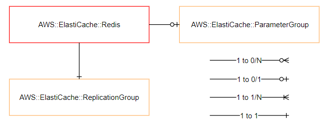

=======================
AWS::ElastiCache::Redis
=======================

Architectural Outcome
=====================

The component launches Managed ElastiCache Resource based on Redis engine.  The resource is configured according to properties and default set out below.

Quick Start
===========

.. literalinclude:: ../samples/elasticache-redis-quickstart.yaml
  :language: yaml
  :caption: AWS::ElastiCache::Redis Quick Start

Resources
=========

Replication Group
-----------------

:Naming pattern: ``ReplicationGroup``
:Required: Yes
:Reference: `AWS::ElastiCache::ReplicationGroup <https://docs.aws.amazon.com/AWSCloudFormation/latest/UserGuide/aws-resource-elasticache-replicationgroup.html>`_

.. table:: Available Properties
    :widths: grid

    +----------------------------+---------------+-------------------------------------------------------+
    | Property                   | Default Value | Comments                                              |
    +============================+===============+=======================================================+
    | AutoMinorVersionUpgrade    |               |                                                       |
    +----------------------------+---------------+-------------------------------------------------------+
    | CacheNodeType              |               | Required                                              |
    +----------------------------+---------------+-------------------------------------------------------+
    | EngineVersion              |               | If ommitted, AWS recommended version is used          |
    +----------------------------+---------------+-------------------------------------------------------+
    | NumNodeGroups              |               | Required                                              |
    +----------------------------+---------------+-------------------------------------------------------+
    | Port                       | 6379          |                                                       |
    +----------------------------+---------------+-------------------------------------------------------+
    | EngineVersion              |               | If ommitted, AWS recommended version is used          |
    +----------------------------+---------------+-------------------------------------------------------+
    | PreferredMaintenanceWindow |               | If omitted, AWS selects an out-of-hours window        |
    +----------------------------+---------------+-------------------------------------------------------+
    | ReplicasPerNodeGroup       |               | Required                                              |
    +----------------------------+---------------+-------------------------------------------------------+
    | SecurityGroupIds           |               |                                                       |
    +----------------------------+---------------+-------------------------------------------------------+
    | SnapshotName               |               | Value must use the Fn::Pipeline::SnapshotId function. |
    +----------------------------+---------------+-------------------------------------------------------+
    | SnapshotRetentionLimit     | 7             |                                                       |
    +----------------------------+---------------+-------------------------------------------------------+
    | SnapshotWindow             |               | If omitted, AWS selects an out-of-hours window        |
    +----------------------------+---------------+-------------------------------------------------------+

Parameter Group
---------------

:Naming pattern: ``ParameterGroup``
:Required: No
:Reference: `AWS::ElastiCache::ParameterGroup <https://docs.aws.amazon.com/AWSCloudFormation/latest/UserGuide/aws-properties-elasticache-parameter-group.html>`_

.. table:: Available Properties
    :widths: grid

    +---------------------------+---------------+----------+
    | Property                  | Default Value | Comments |
    +===========================+===============+==========+
    | CacheParameterGroupFamily |               | Required |
    +---------------------------+---------------+----------+
    | Description               |               | Required |
    +---------------------------+---------------+----------+
    | Properties                |               | Required |
    +---------------------------+---------------+----------+

Encryption
----------

All Redis replication groups are created with encryption at rest and in transit enabled. This option cannot be changed.

See `Data Security in Amazon ElastiCache <https://docs.aws.amazon.com/AmazonElastiCache/latest/red-ug/encryption.html>`_.

Outputs
=======

+-----------------------+-------------------------------------------------------------+----------------------------------------------------------------------+
| Output Name           | Description                                                 | Sample Value                                                         |
+=======================+=============================================================+======================================================================+
| Build                 | Build number                                                | 1                                                                    |
+-----------------------+-------------------------------------------------------------+----------------------------------------------------------------------+
| ReplicationGroupId    | Replication Group Id                                        | contosodemchxzrmj0bl                                                 |
+-----------------------+-------------------------------------------------------------+----------------------------------------------------------------------+
| EndpointAddress       | Endpoint Address                                            | clustercfg.contosodemchxzrmj0bl.yfas8u.apse2.cache.amazonaws.com     |
+-----------------------+-------------------------------------------------------------+----------------------------------------------------------------------+
| Port                  | Port                                                        | 6379                                                                 |
+-----------------------+-------------------------------------------------------------+----------------------------------------------------------------------+
| ReaderEndpointAddress | Reader Endpoint Address (cluster mode disabled)             | replica.contosodem1ygg3jac6u.yfas8u.apse2.cache.amazonaws.com        |
+-----------------------+-------------------------------------------------------------+----------------------------------------------------------------------+
| DeploymentDns         | DNS name of Endpoint Address                                | redis.master-1.redis.contosodemoapp.app.c0.demo.sourced.cloud        |
+-----------------------+-------------------------------------------------------------+----------------------------------------------------------------------+
| ReaderDeploymentDns   | DNS name of Reader Endpoint Address (cluster mode disabled) | reader-redis.master-1.redis.contosodemoapp.app.c0.demo.sourced.cloud |
+-----------------------+-------------------------------------------------------------+----------------------------------------------------------------------+