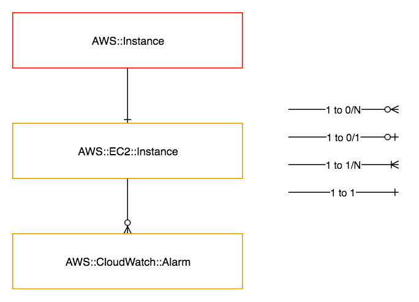

=============
AWS::Instance
=============

Architectural Outcome
=====================

The component launches a single AWS EC2 Instance resource.  The instance can be configured with properties and defaults, as described in section below.
AWS::CloudFormation::init type can be used to configure startup configuration and scripts for the instance at build time.

Quick Start
===========

.. literalinclude:: ../samples/instance-quickstart.yaml
  :language: yaml
  :caption: AWS::Instance Quick Start

Resources
=========

Instance
--------

:Naming pattern: ``Instance``
:Required: Yes
:Reference: `AWS::EC2::Instance <http://docs.aws.amazon.com/AWSCloudFormation/latest/UserGuide/aws-properties-ec2-instance.html>`_

.. table:: Available Properties
    :widths: grid

    +---------------------+---------------+----------------------------------------------------+
    | Property            | Default Value | Comments                                           |
    +=====================+===============+====================================================+
    | BlockDeviceMappings |               |                                                    |
    +---------------------+---------------+----------------------------------------------------+
    | ImageId             |               | Value must use the Fn::Pipeline::ImageId function  |
    +---------------------+---------------+----------------------------------------------------+
    | InstanceType        |               | Required                                           |
    +---------------------+---------------+----------------------------------------------------+
    | KeyName             |               | Key must exist                                     |
    +---------------------+---------------+----------------------------------------------------+
    | SubnetId            | private       | Value must use the Fn::Pipeline::SubnetId function |
    +---------------------+---------------+----------------------------------------------------+

.. table:: Available Top-Level Properties
    :widths: grid

    +---------------------------------------+---------------+----------+
    | Property                              | Default Value | Comments |
    +=======================================+===============+==========+
    | CreationPolicy.ResourceSignal.Timeout | PT15M         |          |
    +---------------------------------------+---------------+----------+
    | CreationPolicy.ResourceSignal.Count   | 1             |          |
    +---------------------------------------+---------------+----------+
    | Metadata                              |               |          |
    +---------------------------------------+---------------+----------+

Network Interfaces
------------------

:Naming pattern: ``*NetworkInterface``
:Required: No
:Reference: `AWS::EC2::NetworkInterface <https://docs.aws.amazon.com/AWSCloudFormation/latest/UserGuide/aws-resource-ec2-network-interface.html>`_
:See Also: `Elastic Network Interfaces <https://docs.aws.amazon.com/AWSEC2/latest/UserGuide/using-eni.html>`_

Specifies additional network interface(s) to be attached to the ec2 instance after launch.
Additional network interfaces are ephemeral, and are automatically mapped to instance subnet & security groups.
The default options will dynamically assign one (1) private ip address from the same subnet as the instance consumable.

The device index will increment by one (1) if more than one (1) additional Elastic Network Interface is defined.

Note: you must ensure that your instance type supports the number of elastic network interfaces defined.

.. table:: Available Properties
    :widths: grid

    +--------------------------------+---------------+-----------------------------------------------------------------------------------------+
    | Property                       | Default Value | Comments                                                                                |
    +================================+===============+=========================================================================================+
    | PrivateIpAddress               | <none>        | Allows assignment of an IP address to the ENI, defaults to dynamically assigned address |
    +--------------------------------+---------------+-----------------------------------------------------------------------------------------+
    | PrivateIpAddresses             | <none>        | Allows assignment of a list of specific IP addresses to the ENI                         |
    +--------------------------------+---------------+-----------------------------------------------------------------------------------------+
    | SecondaryPrivateIpAddressCount | <none>        | Allows assignment of 'n' dynamic IP addresses to the ENI                                |
    +--------------------------------+---------------+-----------------------------------------------------------------------------------------+
    | SourceDestCheck                | <none>        | enable or disable source/destination checking on the ENI                                |
    +--------------------------------+---------------+-----------------------------------------------------------------------------------------+

Alarms
------

:Naming pattern: ``*Alarm``
:Required: No
:Reference: `AWS::CloudWatch::Alarm <http://docs.aws.amazon.com/AWSCloudFormation/latest/UserGuide/aws-properties-cw-alarm.html>`_

.. table:: Available Properties
    :widths: grid

    +--------------------+----------------------------+---------------------+
    | Property           | Default Value              | Comments            |
    +====================+============================+=====================+
    | AlarmActions       |                            | Required            |
    +--------------------+----------------------------+---------------------+
    | ComparisonOperator |                            | Required            |
    +--------------------+----------------------------+---------------------+
    | Dimensions         | Points to AutoScalingGroup | Array of Dimensions |
    +--------------------+----------------------------+---------------------+
    | EvaluationPeriods  | 3                          |                     |
    +--------------------+----------------------------+---------------------+
    | MetricName         | CPUUtilization             |                     |
    +--------------------+----------------------------+---------------------+
    | Namespace          | AWS/EC2                    |                     |
    +--------------------+----------------------------+---------------------+
    | Period             | 60                         |                     |
    +--------------------+----------------------------+---------------------+
    | Statistic          | Average                    |                     |
    +--------------------+----------------------------+---------------------+
    | Threshold          |                            | Required            |
    +--------------------+----------------------------+---------------------+

Log Group Metric Alarms
-----------------------

:Naming pattern: ``*LogGroupMetricAlarm``
:Required: No
:Reference: `AWS::CloudWatch::Alarm <http://docs.aws.amazon.com/AWSCloudFormation/latest/UserGuide/aws-properties-cw-alarm.html>`_

This resource is the same as the Alarm resource, except that it automatically configured to use the Log Group Metric Filter namespace. This allows alarms to be triggered on the contents of the log group through the use of log group metric filters.

.. table:: Available Properties
    :widths: grid

    +--------------------+----------------------------+---------------------+
    | Property           | Default Value              | Comments            |
    +====================+============================+=====================+
    | AlarmActions       |                            | Required            |
    +--------------------+----------------------------+---------------------+
    | ComparisonOperator |                            | Required            |
    +--------------------+----------------------------+---------------------+
    | Dimensions         | Points to AutoScalingGroup | Array of Dimensions |
    +--------------------+----------------------------+---------------------+
    | EvaluationPeriods  | 3                          |                     |
    +--------------------+----------------------------+---------------------+
    | MetricName         | CPUUtilization             |                     |
    +--------------------+----------------------------+---------------------+
    | Period             | 60                         |                     |
    +--------------------+----------------------------+---------------------+
    | Statistic          | Average                    |                     |
    +--------------------+----------------------------+---------------------+
    | Threshold          |                            | Required            |
    +--------------------+----------------------------+---------------------+

Log Group
---------

:Naming pattern: ``LogGroup``
:Required: No
:Reference: `AWS::Logs::LogGroup <https://docs.aws.amazon.com/AWSCloudFormation/latest/UserGuide/aws-resource-logs-loggroup.html>`_

.. table:: Available Properties
    :widths: grid

    +-----------------+---------------+----------+
    | Property        | Default Value | Comments |
    +=================+===============+==========+
    | RetentionInDays | 14            | Optional |
    +-----------------+---------------+----------+

Log Group Metric Filter
-----------------------

:Naming pattern: ``*LogGroupMetricFilter``
:Required: No
:Reference: `AWS::Logs::MetricFilter <https://docs.aws.amazon.com/AWSCloudFormation/latest/UserGuide/aws-resource-logs-metricfilter.html>`_

.. table:: Available Properties
    :widths: grid

    +-----------------------+----------------------------+---------------------+
    | Property              | Default Value              | Comments            |
    +=======================+============================+=====================+
    | FilterPattern         |                            | Required            |
    +-----------------------+----------------------------+---------------------+
    | MetricTransformations |                            | Required            |
    +-----------------------+----------------------------+---------------------+

Security
========

Encryption
----------

All EBS BlockDeviceMappings are created with storage encryption enabled. This option cannot be changed.

See `Amazon EBS Encryption <https://docs.aws.amazon.com/AWSEC2/latest/UserGuide/EBSEncryption.html>`_.

Outputs
=======

+-------------------+------------------------------+--------------+
| Output Name       | Description                  | Sample Value |
+===================+==============================+==============+
| Build             | Build number                 | 2            |
+-------------------+------------------------------+--------------+
| DeploymentDns     | DNS Name of the instance     | <To do>      |
+-------------------+------------------------------+--------------+
| InstanceId        | Id of the instance           | <To do>      |
+-------------------+------------------------------+--------------+
| InstancePrivateIp | Private IP of the instance   | <To do>      |
+-------------------+------------------------------+--------------+
| InstanceId        | Instance Id of Bake Instance | <To do>      |
+-------------------+------------------------------+--------------+
