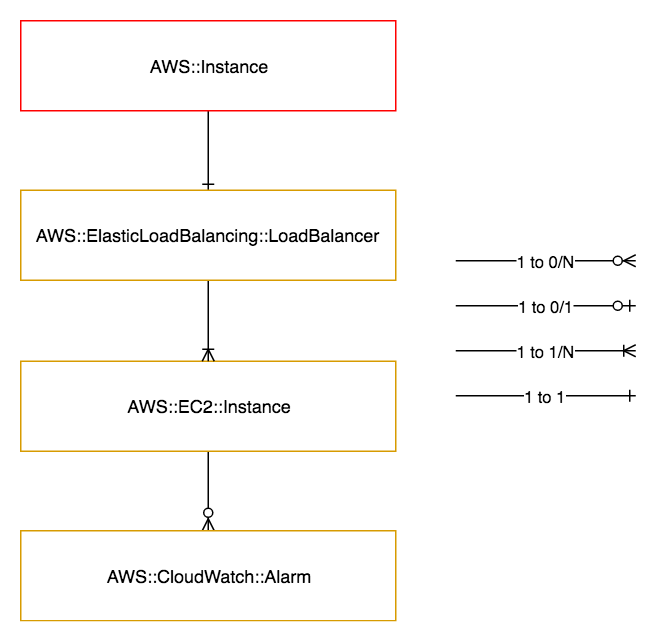

==========================
AWS::LoadBalancedInstances
==========================

Architectural Outcome
=====================

The component launches load balanced EC2 instances.  The resource is configured according to properties and default set out below.

Quick Start
===========

.. literalinclude:: ../samples/loadbalancedinstances-quickstart.yaml
  :language: yaml
  :caption: AWS::LoadBalancedInstances Quick Start

Resources
=========

Load Balancer
-------------

:Naming pattern: ``LoadBalancer``
:Required: Yes
:Reference: `AWS::ElasticLoadBalancing::LoadBalancer <http://docs.aws.amazon.com/AWSCloudFormation/latest/UserGuide/aws-properties-ec2-elb.html>`_

.. table:: Available Properties
    :widths: grid

    +--------------------------------+---------------+----------+
    | Property                       | Default Value | Comments |
    +================================+===============+==========+
    | HealthCheck.HealthyThreshold   | 3             |          |
    +--------------------------------+---------------+----------+
    | HealthCheck.Interval           | 15            |          |
    +--------------------------------+---------------+----------+
    | HealthCheck.Target             |               | Required |
    +--------------------------------+---------------+----------+
    | HealthCheck.Timeout            | 5             |          |
    +--------------------------------+---------------+----------+
    | HealthCheck.UnhealthyThreshold | 5             |          |
    +--------------------------------+---------------+----------+
    | LBCookieStickinessPolicy       |               |          |
    +--------------------------------+---------------+----------+
    | AppCookieStickinessPolicy      |               |          |
    +--------------------------------+---------------+----------+
    | Listeners                      |               | Required |
    +--------------------------------+---------------+----------+
    | Policies                       |               |          |
    +--------------------------------+---------------+----------+
    | Scheme                         | internal      |          |
    +--------------------------------+---------------+----------+

Instances
---------

:Naming pattern: ``*Instance``
:Required: One or more
:Reference: `AWS::EC2::Instance <http://docs.aws.amazon.com/AWSCloudFormation/latest/UserGuide/aws-properties-ec2-instance.html>`_

This resource is used to configure the instance used to bake the application AMI. The configuration of this resource should therefore include any required application bootstrap actions.

.. table:: Available Properties
    :widths: grid

    +---------------------+---------------+----------------------------------------------------+
    | Property            | Default Value | Comments                                           |
    +=====================+===============+====================================================+
    | BlockDeviceMappings |               |                                                    |
    +---------------------+---------------+----------------------------------------------------+
    | ImageId             |               | Value must use the Fn::Pipeline::ImageId function  |
    +---------------------+---------------+----------------------------------------------------+
    | InstanceType        |               | Required                                           |
    +---------------------+---------------+----------------------------------------------------+
    | KeyName             |               | Key must exist                                     |
    +---------------------+---------------+----------------------------------------------------+
    | SubnetId            | private       | Value must use the Fn::Pipeline::SubnetId function |
    +---------------------+---------------+----------------------------------------------------+

.. table:: Available Top-Level Properties
    :widths: grid

    +---------------------------------------+---------------+----------+
    | Property                              | Default Value | Comments |
    +=======================================+===============+==========+
    | CreationPolicy.ResourceSignal.Timeout | PT15M         |          |
    +---------------------------------------+---------------+----------+
    | CreationPolicy.ResourceSignal.Count   | 1             |          |
    +---------------------------------------+---------------+----------+
    | Metadata                              |               |          |
    +---------------------------------------+---------------+----------+

Alarms
------

:Naming pattern: ``*Alarm``
:Required: No
:Reference: `AWS::CloudWatch::Alarm <http://docs.aws.amazon.com/AWSCloudFormation/latest/UserGuide/aws-properties-cw-alarm.html>`_

.. table:: Available Properties
    :widths: grid

    +--------------------+----------------------------+---------------------+
    | Property           | Default Value              | Comments            |
    +====================+============================+=====================+
    | AlarmActions       |                            | Required            |
    +--------------------+----------------------------+---------------------+
    | ComparisonOperator |                            | Required            |
    +--------------------+----------------------------+---------------------+
    | Dimensions         | Points to AutoScalingGroup | Array of Dimensions |
    +--------------------+----------------------------+---------------------+
    | EvaluationPeriods  | 3                          |                     |
    +--------------------+----------------------------+---------------------+
    | MetricName         | CPUUtilization             |                     |
    +--------------------+----------------------------+---------------------+
    | Namespace          | AWS/EC2                    |                     |
    +--------------------+----------------------------+---------------------+
    | Period             | 60                         |                     |
    +--------------------+----------------------------+---------------------+
    | Statistic          | Average                    |                     |
    +--------------------+----------------------------+---------------------+
    | Threshold          |                            | Required            |
    +--------------------+----------------------------+---------------------+

Log Group Metric Alarms
-----------------------

:Naming pattern: ``*LogGroupMetricAlarm``
:Required: No
:Reference: `AWS::CloudWatch::Alarm <http://docs.aws.amazon.com/AWSCloudFormation/latest/UserGuide/aws-properties-cw-alarm.html>`_

This resource is the same as the Alarm resource, except that it automatically configured to use the Log Group Metric Filter namespace. This allows alarms to be triggered on the contents of the log group through the use of log group metric filters.

.. table:: Available Properties
    :widths: grid

    +--------------------+----------------------------+---------------------+
    | Property           | Default Value              | Comments            |
    +====================+============================+=====================+
    | AlarmActions       |                            | Required            |
    +--------------------+----------------------------+---------------------+
    | ComparisonOperator |                            | Required            |
    +--------------------+----------------------------+---------------------+
    | Dimensions         | Points to AutoScalingGroup | Array of Dimensions |
    +--------------------+----------------------------+---------------------+
    | EvaluationPeriods  | 3                          |                     |
    +--------------------+----------------------------+---------------------+
    | MetricName         | CPUUtilization             |                     |
    +--------------------+----------------------------+---------------------+
    | Period             | 60                         |                     |
    +--------------------+----------------------------+---------------------+
    | Statistic          | Average                    |                     |
    +--------------------+----------------------------+---------------------+
    | Threshold          |                            | Required            |
    +--------------------+----------------------------+---------------------+

Log Group
---------

:Naming pattern: ``LogGroup``
:Required: No
:Reference: `AWS::Logs::LogGroup <https://docs.aws.amazon.com/AWSCloudFormation/latest/UserGuide/aws-resource-logs-loggroup.html>`_

.. table:: Available Properties
    :widths: grid

    +-----------------+---------------+----------+
    | Property        | Default Value | Comments |
    +=================+===============+==========+
    | RetentionInDays | 14            | Optional |
    +-----------------+---------------+----------+

Log Group Metric Filter
-----------------------

:Naming pattern: ``*LogGroupMetricFilter``
:Required: No
:Reference: `AWS::Logs::MetricFilter <https://docs.aws.amazon.com/AWSCloudFormation/latest/UserGuide/aws-resource-logs-metricfilter.html>`_

.. table:: Available Properties
    :widths: grid

    +-----------------------+----------------------------+---------------------+
    | Property              | Default Value              | Comments            |
    +=======================+============================+=====================+
    | FilterPattern         |                            | Required            |
    +-----------------------+----------------------------+---------------------+
    | MetricTransformations |                            | Required            |
    +-----------------------+----------------------------+---------------------+

Security
========

Encryption
----------

All EBS BlockDeviceMappings are created with storage encryption enabled. This option cannot be changed.

See `Amazon EBS Encryption <https://docs.aws.amazon.com/AWSEC2/latest/UserGuide/EBSEncryption.html>`_.

Security Rules
--------------

Security rules between your ELB and your instances are automatically configured by the pipeline according to your listener configuration. You therefore do not need to create rules to allow your ElbSecurityGroup to access your AsgSecurityGroup.

Outputs
=======

+--------------------------+---------------------------------------------------------+--------------+
| Output Name              | Description                                             | Sample Value |
+==========================+=========================================================+==============+
| Build                    | Build number                                            | 2            |
+--------------------------+---------------------------------------------------------+--------------+
| LoadBalancerName         | Name of load balancer                                   | <To do>      |
+--------------------------+---------------------------------------------------------+--------------+
| PrivateDeploymentDns     | Private DNS name of deployed component (build-specific) | <To do>      |
+--------------------------+---------------------------------------------------------+--------------+
| PublicDeploymentDns      | Public DNS name of deployed component (build-specific)  | <To do>      |
+--------------------------+---------------------------------------------------------+--------------+
