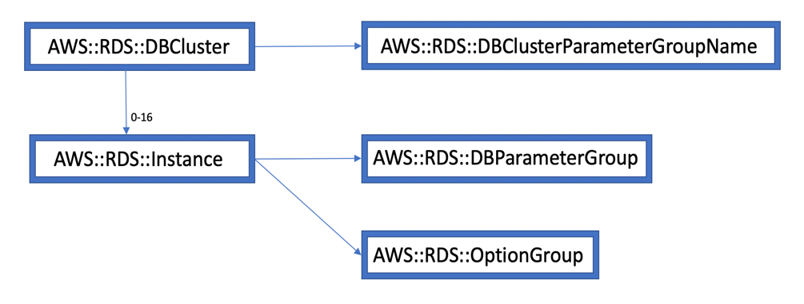

============================
AWS::RDS::Aurora::PostgreSQL
============================

Architectural Outcome
=====================

The component creates an Amazon Aurora DB cluster in PostgreSQL mode. You can only create this resource in regions where Amazon Aurora is supported. The default DeletionPolicy for DBCluster resources is Snapshot. The resource is configured according to properties and default set out below.

Quick Start
===========

.. literalinclude:: ../samples/rds-aurora-postgresql-quickstart.yaml
  :language: jinja
  :caption: AWS::RDS::Aurora::PostgreSQL Quick Start

Resources
=========

Database Cluster
----------------

:Naming pattern: ``DbCluster``
:Required: Yes
:Reference: `AWS::RDS::DBCluster <https://docs.aws.amazon.com/AWSCloudFormation/latest/UserGuide/aws-resource-rds-dbcluster.html>`_

.. table:: Available Properties
    :widths: grid

    +-------------------------------+---------------+------------------------------------------------+
    | Property                      | Default Value | Comments                                       |
    +===============================+===============+================================================+
    | DBClusterIdentifier           |               |                                                |
    +-------------------------------+---------------+------------------------------------------------+
    | DBClusterParameterGroupName   |               | If omitted, default.aurora5.6 is used          |
    +-------------------------------+---------------+------------------------------------------------+
    | DBSubnetGroupName             |               |                                                |
    +-------------------------------+---------------+------------------------------------------------+
    | DeletionProtection            | disabled      |                                                |
    +-------------------------------+---------------+------------------------------------------------+
    | EnableCloudwatchLogsExports   |               |                                                |
    +-------------------------------+---------------+------------------------------------------------+
    | Engine                        |               | Required                                       |
    +-------------------------------+---------------+------------------------------------------------+
    | EngineMode                    |               |                                                |
    +-------------------------------+---------------+------------------------------------------------+
    | EngineVersion                 |               |                                                |
    +-------------------------------+---------------+------------------------------------------------+
    | KmsKeyId                      |               |                                                |
    +-------------------------------+---------------+------------------------------------------------+
    | MasterUsername                |               |                                                |
    +-------------------------------+---------------+------------------------------------------------+
    | MasterUserPassword            |               |                                                |
    +-------------------------------+---------------+------------------------------------------------+
    | Port                          | 3306          |                                                |
    +-------------------------------+---------------+------------------------------------------------+
    | PreferredBackupWindow         | 30            |                                                |
    +-------------------------------+---------------+------------------------------------------------+
    | PreferredMaintenanceWindow    | 30            |                                                |
    +-------------------------------+---------------+------------------------------------------------+
    | StorageEncrypted              | true          |                                                |
    +-------------------------------+---------------+------------------------------------------------+
    | VpcSecurityGroupIds           |               |                                                |
    +-------------------------------+---------------+------------------------------------------------+

DBCluster Parameter Group
-------------------------

:Naming pattern: ``DBClusterParameterGroup``
:Required: No
:Reference: `AWS::RDS::DBClusterParameterGroup <https://docs.aws.amazon.com/AWSCloudFormation/latest/UserGuide/aws-resource-rds-dbclusterparametergroup.html>`_

.. table:: Available Properties
    :widths: grid

    +-------------+---------------+----------+
    | Property    | Default Value | Comments |
    +=============+===============+==========+
    | Description |               | Required |
    +-------------+---------------+----------+
    | Family      |               | Required |
    +-------------+---------------+----------+
    | Parameters  |               | Required |
    +-------------+---------------+----------+

Parameter Group
---------------

:Naming pattern: ``ParameterGroup``
:Required: No
:Reference: `AWS::RDS::DBParameterGroup <https://docs.aws.amazon.com/AWSCloudFormation/latest/UserGuide/aws-properties-rds-dbparametergroup.html>`_

.. table:: Available Properties
    :widths: grid

    +-------------+---------------+----------+
    | Property    | Default Value | Comments |
    +=============+===============+==========+
    | Description |               | Required |
    +-------------+---------------+----------+
    | Family      |               | Required |
    +-------------+---------------+----------+
    | Parameters  |               | Required |
    +-------------+---------------+----------+

Audit Log Group
---------------

:Naming pattern: ``AuditLogGroup``
:Required: No
:Reference: `AWS::Logs::LogGroup <https://docs.aws.amazon.com/AWSCloudFormation/latest/UserGuide/aws-resource-logs-loggroup.html>`_

.. table:: Available Properties
    :widths: grid

    +-----------------+---------------+----------+
    | Property        | Default Value | Comments |
    +=================+===============+==========+
    | RetentionInDays | 14            |          |
    +-----------------+---------------+----------+

The log group name is fixed to ``/aws/rds/instance/{DbInstanceId}/audit``

Error Log Group
---------------

:Naming pattern: ``ErrorLogGroup``
:Required: No
:Reference: `AWS::Logs::LogGroup <https://docs.aws.amazon.com/AWSCloudFormation/latest/UserGuide/aws-resource-logs-loggroup.html>`_

.. table:: Available Properties
    :widths: grid

    +-----------------+---------------+----------+
    | Property        | Default Value | Comments |
    +=================+===============+==========+
    | RetentionInDays | 14            |          |
    +-----------------+---------------+----------+

The log group name is fixed to ``/aws/rds/instance/{DbInstanceId}/error``

General Log Group
-----------------

:Naming pattern: ``GeneralLogGroup``
:Required: No
:Reference: `AWS::Logs::LogGroup <https://docs.aws.amazon.com/AWSCloudFormation/latest/UserGuide/aws-resource-logs-loggroup.html>`_

.. table:: Available Properties
    :widths: grid

    +-----------------+---------------+----------+
    | Property        | Default Value | Comments |
    +=================+===============+==========+
    | RetentionInDays | 14            |          |
    +-----------------+---------------+----------+

The log group name is fixed to ``/aws/rds/instance/{DbInstanceId}/general``

Slow Query Log Group
--------------------

:Naming pattern: ``SlowQueryLogGroup``
:Required: No
:Reference: `AWS::Logs::LogGroup <https://docs.aws.amazon.com/AWSCloudFormation/latest/UserGuide/aws-resource-logs-loggroup.html>`_

.. table:: Available Properties
    :widths: grid

    +-----------------+---------------+----------+
    | Property        | Default Value | Comments |
    +=================+===============+==========+
    | RetentionInDays | 14            |          |
    +-----------------+---------------+----------+

The log group name is fixed to ``/aws/rds/instance/{DbInstanceId}/slowquery``

Security
========

Encryption
----------

All RDS instances of the Cluster are created with storage encryption enabled. This option cannot be changed.

See `Encrypting Amazon RDS Resources <https://docs.aws.amazon.com/AmazonRDS/latest/UserGuide/Overview.Encryption.html>`_.

Outputs
=======

+---------------------+-----------------------------------+--------------+
| Output Name         | Description                       | Sample Value |
+=====================+===================================+==============+
| Build               | Build number                      | 1            |
+---------------------+-----------------------------------+--------------+
| DbClusterEndpoint   | DB Cluster Endpoint               |              |
+---------------------+-----------------------------------+--------------+
| DBClusterId         | DB Cluster Id                     |              |
+---------------------+-----------------------------------+--------------+
| DbClusterPort       | DB Cluster Port                   | 3306         |
+---------------------+-----------------------------------+--------------+
| DeploymentDns       | DNS name of DBCluster writer node |              |
+---------------------+-----------------------------------+--------------+
| DeploymentReaderDns | DNS name of reader nodes          |              |
+---------------------+-----------------------------------+--------------+
