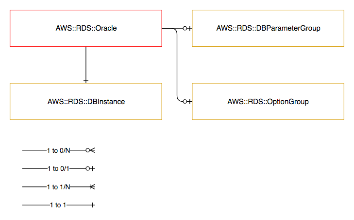

================
AWS::RDS::Oracle
================

Architectural Outcome
=====================

The component launches Managed database Resource based on Oracle engine.  The resource is configured according to properties and default set out below.

Quick Start
===========

.. literalinclude:: ../samples/rds-oracle-quickstart.yaml
  :language: yaml
  :caption: AWS::RDS::Oracle Quick Start

Resources
=========

Database Instance
-----------------

:Naming pattern: ``DbInstance``
:Required: Yes
:Reference: `AWS::RDS::DBInstance <http://docs.aws.amazon.com/AWSCloudFormation/latest/UserGuide/aws-properties-rds-database-instance.html>`_

.. table:: Available Properties
    :widths: grid

    +----------------------------+---------------+------------------------------------------------+
    | Property                   | Default Value | Comments                                       |
    +============================+===============+================================================+
    | AllocatedStorage           | <none>        | Required                                       |
    +----------------------------+---------------+------------------------------------------------+
    | AllowMajorVersionUpgrade   | <none>        |                                                |
    +----------------------------+---------------+------------------------------------------------+
    | AutoMinorVersionUpgrade    | <none>        |                                                |
    +----------------------------+---------------+------------------------------------------------+
    | BackupRetentionPeriod      | 7             |                                                |
    +----------------------------+---------------+------------------------------------------------+
    | CharacterSetName           | <none>        |                                                |
    +----------------------------+---------------+------------------------------------------------+
    | DBInstanceClass            | <none>        | Required                                       |
    +----------------------------+---------------+------------------------------------------------+
    | LicenseModel               | <none>        | Required                                       |
    +----------------------------+---------------+------------------------------------------------+
    | DBName                     | <none>        | Max 8 Characters                               |
    +----------------------------+---------------+------------------------------------------------+
    | Engine                     | <none>        | oracle-se, oracle-se1, oracle-se2, oracle-ee   |
    +----------------------------+---------------+------------------------------------------------+
    | EngineVersion              | <none>        | If ommitted, AWS recommended version is used   |
    +----------------------------+---------------+------------------------------------------------+
    | Iops                       | <none>        |                                                |
    +----------------------------+---------------+------------------------------------------------+
    | MasterUsername             | <none>        | Required                                       |
    +----------------------------+---------------+------------------------------------------------+
    | MultiAZ                    | <none>        |                                                |
    +----------------------------+---------------+------------------------------------------------+
    | Port                       | <none>        | Set RDS Endpoint TCP port                      |
    +----------------------------+---------------+------------------------------------------------+
    | PreferredBackupWindow      | <none>        | If omitted, AWS selects an out-of-hours window |
    +----------------------------+---------------+------------------------------------------------+
    | PreferredMaintenanceWindow | <none>        | If omitted, AWS selects an out-of-hours window |
    +----------------------------+---------------+------------------------------------------------+
    | StorageEncrypted           | true          |                                                |
    +----------------------------+---------------+------------------------------------------------+
    | StorageType                | gp2           |                                                |
    +----------------------------+---------------+------------------------------------------------+

Parameter Group
---------------

:Naming pattern: ``ParameterGroup``
:Required: No
:Reference: `AWS::RDS::DBParameterGroup <https://docs.aws.amazon.com/AWSCloudFormation/latest/UserGuide/aws-properties-rds-dbparametergroup.html>`_

.. table:: Available Properties
    :widths: grid

    +-------------+---------------+----------+
    | Property    | Default Value | Comments |
    +=============+===============+==========+
    | Description |               | Required |
    +-------------+---------------+----------+
    | Family      |               | Required |
    +-------------+---------------+----------+
    | Parameters  |               | Required |
    +-------------+---------------+----------+

Option Group
------------

:Naming pattern: ``OptionGroup``
:Required: No
:Reference: `AWS::RDS::OptionGroup <https://docs.aws.amazon.com/AWSCloudFormation/latest/UserGuide/aws-resource-rds-optiongroup.html>`_

.. table:: Available Properties
    :widths: grid

    +------------------------+---------------+----------+
    | Property               | Default Value | Comments |
    +========================+===============+==========+
    | EngineName             |               | Required |
    +------------------------+---------------+----------+
    | MajorEngineVersion     |               | Required |
    +------------------------+---------------+----------+
    | OptionGroupDescription |               | Required |
    +------------------------+---------------+----------+
    | OptionConfigurations   |               | Required |
    +------------------------+---------------+----------+

Security
========

Encryption
----------

All RDS instances are created with storage encryption enabled. This option cannot be changed.

See `Encrypting Amazon RDS Resources <https://docs.aws.amazon.com/AmazonRDS/latest/UserGuide/Overview.Encryption.html>`_.

Outputs
=======

+--------------------+--------------------------+--------------+
| Output Name        | Description              | Sample Value |
+====================+==========================+==============+
| Build              | Build number             | 1            |
+--------------------+--------------------------+--------------+
| DbInstanceEndpoint | DB Instance Endpoint     | <To do>      |
+--------------------+--------------------------+--------------+
| DBInstanceId       | DB Instance Id           | <To do>      |
+--------------------+--------------------------+--------------+
| DbInstancePort     | DB Instance Port         | 1521         |
+--------------------+--------------------------+--------------+
| DeploymentDns      | DNS name of RDS Instance | <To do>      |
+--------------------+--------------------------+--------------+
