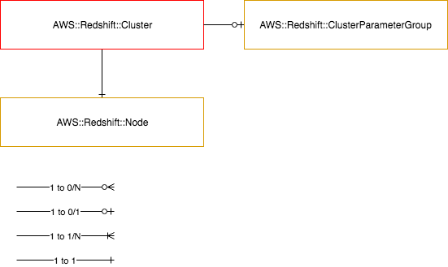

======================
AWS::Redshift::Cluster
======================

Architectural Outcome
=====================

The component launches a Redshift - managed columnar database engine.  The resource is configured according to properties and default set out below.

Quick Start
===========

.. literalinclude:: ../samples/redshift-quickstart.yaml
  :language: yaml
  :caption: Redshift Cluster quick start definition

Resources
=========

Database Instance
-----------------

:Naming pattern: ``Cluster``
:Required: Yes
:Reference: `AWS::Redshift::Cluster <https://docs.aws.amazon.com/AWSCloudFormation/latest/UserGuide/aws-resource-redshift-cluster.html>`_

.. table:: Available Properties
    :widths: grid

    +----------------------------------+---------------+---------------------------------------------------------------------------------------------------------+
    | Property                         | Default Value | Comments                                                                                                |
    +==================================+===============+=========================================================================================================+
    | AllowVersionUpgrade              | false         | Not Required                                                                                            |
    +----------------------------------+---------------+---------------------------------------------------------------------------------------------------------+
    | AutomatedSnapshotRetentionPeriod | 7             | Not Required                                                                                            |
    +----------------------------------+---------------+---------------------------------------------------------------------------------------------------------+
    | ClusterParameterGroupName        |               | Not Required                                                                                            |
    +----------------------------------+---------------+---------------------------------------------------------------------------------------------------------+
    | ClusterType                      |               | Required (single-node or multi-node)                                                                    |
    +----------------------------------+---------------+---------------------------------------------------------------------------------------------------------+
    | DBName                           |               | Required                                                                                                |
    +----------------------------------+---------------+---------------------------------------------------------------------------------------------------------+
    | MasterUsername                   |               | Required                                                                                                |
    +----------------------------------+---------------+---------------------------------------------------------------------------------------------------------+
    | NodeType                         | dc2.large     | Required                                                                                                |
    +----------------------------------+---------------+---------------------------------------------------------------------------------------------------------+
    | NumberOfNodes                    | 1             | Conditional, not req for single-node                                                                    |
    +----------------------------------+---------------+---------------------------------------------------------------------------------------------------------+
    | Port                             | 5439          | Not Required                                                                                            |
    +----------------------------------+---------------+---------------------------------------------------------------------------------------------------------+
    | SnapshotIdentifier               |               | Value must use the Fn::Pipeline::SnapshotId function. Will optionally set OwnerAccount based off facts. |
    +----------------------------------+---------------+---------------------------------------------------------------------------------------------------------+
    | PreferredMaintenanceWindow       |               | If omitted, AWS selects an out-of-hours window                                                          |
    +----------------------------------+---------------+---------------------------------------------------------------------------------------------------------+

Parameter Group
---------------

:Naming pattern: ``ParameterGroup``
:Required: No
:Reference: `AWS::Redshift::ClusterParameterGroup <https://docs.aws.amazon.com/AWSCloudFormation/latest/UserGuide/aws-resource-redshift-clusterparametergroup.html>`_

.. table:: Available Properties
    :widths: grid

    +-----------------------+---------------+----------+
    | Property              | Default Value | Comments |
    +=======================+===============+==========+
    | Description           |               | Required |
    +-----------------------+---------------+----------+
    | ParameterGroupFamily  |               | Required |
    +-----------------------+---------------+----------+
    | Parameters            |               | Required |
    +-----------------------+---------------+----------+

Logging Options - Audit
-----------------------
:Reference: `AWS::Redshift::Cluster - Log Group <https://docs.aws.amazon.com/AWSCloudFormation/latest/UserGuide/aws-properties-redshift-cluster-loggingproperties.html>`_

The logs are stored in the automation bucket under the following structure
``{{ context.Portfolio }}/{{ context.App }}/{{ context.BranchShortName }}/{{ component_name }}/audit/``

Restoring from Snapshots
========================

The ``AWS::Redshift::Cluster`` Consumable supports deployment from a snapshot. See the quickstart above for example usage.

This relies upon facts being defined:

.. code-block:: yaml
    :caption: Example apps.yaml entry

    prn:demo:app:*:*:
      Account: nonprod-auto
      Region: sin
      AccountAliases:
        OldDev: '126710907682' # old dev acct
      SnapshotAliases:
        AWS::Redshift::Cluster:
          EimDatamart:
            SnapshotIdentifier: 'eim-datamart-dev-manual-snapshot'
            AccountAlias: OldDev
          demo-app-redshift-502:
            SnapshotIdentifier: 'rs:demo-app-redshift-502-red2-2019-01-24-05-09-35'

See `Amazon Redshift Snapshots <https://docs.aws.amazon.com/redshift/latest/mgmt/working-with-snapshots.html>`_ for more details.

Security
========

Encryption
----------

All Redshift instances are created with storage encryption enabled. This option cannot be changed.

See `Encrypting Amazon Redshift Resources <https://docs.aws.amazon.com/redshift/latest/mgmt/working-with-db-encryption.html>`_.

Outputs
=======

+----------------------------+-------------------------------+--------------+
| Output Name                | Description                   | Sample Value |
+============================+===============================+==============+
| Build                      | Build number                  |      1       |
+----------------------------+-------------------------------+--------------+
| RedshiftClusterEndpoint    | RedshiftCluster Endpoint      | <To do>      |
+----------------------------+-------------------------------+--------------+
| RedshiftClusterId          | RedshiftCluster Id            | <To do>      |
+----------------------------+-------------------------------+--------------+
| RedshiftClusterPort        | RedshiftCluster Port          | 5439         |
+----------------------------+-------------------------------+--------------+
| DeploymentDns              | DNS name for Redshift         | <To do>      |
+----------------------------+-------------------------------+--------------+
