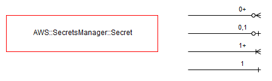

===========================
AWS::SecretsManager::Secret
===========================

Architectural Outcome
=====================

This component defines a "secret" in AWS Secrets Manager, which generates a password and stores it into a json hash of your design as the secret. By default "password" is the value used in ``GenerateSecretString.GenerateStringKey``.

This secret can be accessed by your components/resources, such as Instance, Serverless, etc.

Quick Start
===========

.. literalinclude:: ../samples/secret-quickstart.yaml
  :language: yaml
  :caption: AWS::SecretsManager::Secret Quick Start

Resources
=========

Secret
------

:Naming pattern: ``Secret``
:Required: Yes
:Reference: `AWS::SecretsManager::Secret <https://docs.aws.amazon.com/AWSCloudFormation/latest/UserGuide/aws-resource-secretsmanager-secret.html>`_

+---------------------------------------------------------------------------------------------------------------------------------------------------------+---------------+--------------------------------------------------------------+
| Property                                                                                                                                                | Default Value | Comments                                                     |
+=========================================================================================================================================================+===============+==============================================================+
| Description                                                                                                                                             | Optional      | Generic default description otherwise.                       |
+---------------------------------------------------------------------------------------------------------------------------------------------------------+---------------+--------------------------------------------------------------+
| `GenerateSecretString <https://docs.aws.amazon.com/AWSCloudFormation/latest/UserGuide/aws-properties-secretsmanager-secret-generatesecretstring.html>`_ |               | You can use the GenerateSecretString property as part of the |
|                                                                                                                                                         |               | AWS::SecretsManager::Secret resource type to dynamically     |
|                                                                                                                                                         |               | generate a random text string to use as a password.          |
+---------------------------------------------------------------------------------------------------------------------------------------------------------+---------------+--------------------------------------------------------------+

Security
========

Security rules
--------------

.. note::

   For now, IAM is applied by convention to relevant Consumables to read secrets prefixed by ``$portfolio-$app``. In future, we may control explicitly what components can read a secret based off ``Pipeline::Security``.

    .. code-block:: yaml

        - Effect: Allow
          Action:
            - secretsmanager:GetSecretValue
          Resource:
            - Fn::Sub: "arn:aws:secretsmanager:${AWS::Region}:${AWS::AccountId}:secret:{{ context.Portfolio }}-{{ context.App }}-*"

Encryption
----------

Secrets are automatically encrypted using app+env KMS key (e.g. ``demo-app-nonprod``). This option cannot be changed.

.. note::
    For now, if another app wants to access that app's secrets, the use of ``DefaultManagedPolicyArns`` is required to permit cross-app access. Speak with CCoE for assistance.

Rotation
========

Rotation not currently supported, but will be in future enhancements.

.. note::

    Due to our security posture on VPCs (using bind for dns in coreservices accounts), in future we'll implement `custom lambdas for rotation. <https://docs.aws.amazon.com/secretsmanager/latest/userguide/reference_available-rotation-templates.html>`_

Getting the value of a secret
=============================

From an EC2 instance
--------------------

Making use of context variables via ``DependsOn``, we can do the following to extract a secret, using its component name, in this example, ``mysecret1``:

.. code-block:: bash

    #!/usr/bin/bash
    set -eu
    source /etc/profile.d/deployment_information.sh
    source /opt/pipeline/web/context/context.sh
    aws secretsmanager get-secret-value --secret-id $mysecret1_SecretArn \
    --region $PIPELINE_AWS_REGION \
    --output text --query SecretString | jq .password -r

From the AWS Console
--------------------

Assuming you can federate into a role which gives you AWS Console access, you can maintain your secrets via the console.

Setting the value of a secret
=============================

Assuming you can federate into a role which gives you AWS Console access, you can maintain your secrets via the console.

Outputs
=======

+-------------+-------------+----------------------------------------------------------------------------------------+
| Output Name | Description | Sample Value                                                                           |
+=============+=============+========================================================================================+
| SecretArn   | Secret ARN  | arn:aws:secretsmanager:ap-southeast-1:378888410647:secret:demo-app-secrets-test-j2VFE9 |
+-------------+-------------+----------------------------------------------------------------------------------------+

Examples
========

Secret that's used by an Instance
---------------------------------

Here's a minimalist example of using cfn-init to decrypt a secret and sed it into an application file:

.. code-block:: yaml

    Metadata:
      AWS::CloudFormation::Init:
          commands:
            01-secretsmanager-demo:
              command: 'sed -i "s/SecretsManagerSecret/$(aws secretsmanager get-secret-value --secret-id "demo-app-secrets-test" --output text --query SecretString --region $PIPELINE_AWS_REGION)/g" /opt/myapp/config.yaml'

