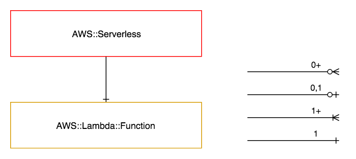

========================
AWS::Serverless / Lambda
========================

Architectural Outcome
=====================

The component creates a lambda function. The resource is configured according to properties and default set out below.

Quick Start
===========

.. literalinclude:: ../samples/serverless-quickstart.yaml
  :language: yaml
  :caption: AWS::Serverless Quick Start

Resources
=========

Lambda Function
---------------

:Naming pattern: ``Function``
:Required: Yes
:Reference: `AWS::Lambda::Function <http://docs.aws.amazon.com/AWSCloudFormation/latest/UserGuide/aws-resource-lambda-function.html>`_

.. table:: Available Properties
    :widths: grid

    +-------------+---------------------------+----------------------------------------------------+
    | Property    | Default Value             | Comments                                           |
    +=============+===========================+====================================================+
    | Code        |                           | Required                                           |
    +-------------+---------------------------+----------------------------------------------------+
    | Environment | See :ref:`env-vars` table |                                                    |
    +-------------+---------------------------+----------------------------------------------------+
    | Handler     | index.handler             |                                                    |
    +-------------+---------------------------+----------------------------------------------------+
    | MemorySize  |                           | Required                                           |
    +-------------+---------------------------+----------------------------------------------------+
    | Runtime     |                           | Required                                           |
    +-------------+---------------------------+----------------------------------------------------+
    | Timeout     |                           | Required                                           |
    +-------------+---------------------------+----------------------------------------------------+
    | VpcConfig   |                           | Must use Fn::Pipeline::LambdaVpcConfig function    |
    +-------------+---------------------------+----------------------------------------------------+

.. _env-vars:
.. table:: Environment Variables
    :widths: auto

    +----------------------------+----------------------------------------------+
    | Environment Variable Name  | Description                                  |
    +============================+==============================================+
    | PIPELINE_AWS_REGION        | AWS region                                   |
    +----------------------------+----------------------------------------------+
    | PIPELINE_AWS_ACCOUNT_ID    | AWS account id                               |
    +----------------------------+----------------------------------------------+
    | PIPELINE_KMS_KEY_ARN       | Secrets KMS key ARN                          |
    +----------------------------+----------------------------------------------+
    | PIPELINE_PORTFOLIO         | Portfolio name                               |
    +----------------------------+----------------------------------------------+
    | PIPELINE_APP               | Application name                             |
    +----------------------------+----------------------------------------------+
    | PIPELINE_BRANCH            | Branch                                       |
    +----------------------------+----------------------------------------------+
    | PIPELINE_BRANCH_SHORT_NAME | Shortened branch name, no special characters |
    +----------------------------+----------------------------------------------+
    | PIPELINE_BUILD             | Build number                                 |
    +----------------------------+----------------------------------------------+
    | PIPELINE_COMPONENT         | Component name                               |
    +----------------------------+----------------------------------------------+
    | PIPELINE_PROXY_URL         | Outbound proxy URL                           |
    +----------------------------+----------------------------------------------+
    | PIPELINE_NO_PROXY          | No-proxy comma-separated list                |
    +----------------------------+----------------------------------------------+

CloudWatch Events Rules
-----------------------

:Naming pattern: ``*EventRule``
:Required: No
:Reference: `AWS::Events::Rule <https://docs.aws.amazon.com/AWSCloudFormation/latest/UserGuide/aws-resource-events-rule.html>`_

.. table:: Available Properties
    :widths: grid

    +--------------------+---------------+------------------------------------------------------------------------------------------------------+
    | Property           | Default Value | Comments                                                                                             |
    +====================+===============+======================================================================================================+
    | Description        |               |                                                                                                      |
    +--------------------+---------------+------------------------------------------------------------------------------------------------------+
    | ScheduleExpression |               | Required. Only cron(...) expressions are supported.                                                  |
    +--------------------+---------------+------------------------------------------------------------------------------------------------------+
    | Targets            |               | Optional list of Target objects. Only supports list length of 1. See :ref:`target-properties` table. |
    +--------------------+---------------+------------------------------------------------------------------------------------------------------+

.. _target-properties:
.. table:: Available `Target <https://docs.aws.amazon.com/AWSCloudFormation/latest/UserGuide/aws-properties-events-rule-target.html>`_ Properties
    :widths: grid

    +------------------+---------------+------------------------------------------------------------------------+
    | Property         | Default Value | Comments                                                               |
    +==================+===============+========================================================================+
    | Arn              | 'build' scope | Specify Fn::Pipeline::LambdaArn to specify either 'build' or 'release' |
    +------------------+---------------+------------------------------------------------------------------------+
    | Input            |               |                                                                        |
    +------------------+---------------+------------------------------------------------------------------------+
    | InputPath        |               |                                                                        |
    +------------------+---------------+------------------------------------------------------------------------+
    | InputTransformer |               |                                                                        |
    +------------------+---------------+------------------------------------------------------------------------+

SNS Topic Subscriptions
-----------------------

Currently only allows subscription to S3 Event Notifications.

:Naming pattern: ``*TopicSubscription``
:Required: No
:Reference: `AWS::SNS::Subscription <https://docs.aws.amazon.com/AWSCloudFormation/latest/UserGuide/aws-resource-sns-subscription.html>`_

.. table:: Available Properties
    :widths: grid

    +----------+---------------+-----------------------------------------------------------------------+
    | Property | Default Value | Comments                                                              |
    +==========+===============+=======================================================================+
    | Endpoint | 'build' scope | Specify Fn::Pipeline::LambdaArn to select either 'build' or 'release' |
    +----------+---------------+-----------------------------------------------------------------------+
    | TopicArn |               | Required. Must specify Fn::Pipeline::GetOutput function.              |
    +----------+---------------+-----------------------------------------------------------------------+

Security
========

Security rules
--------------

+-----------------+-------------------------+
| Allow Rule Name | Included Actions        |
+=================+=========================+
| invoke          | - lambda:InvokeFunction |
+-----------------+-------------------------+

Encryption
----------

Lambda environment variables are automatically encrypted using KMS. This option cannot be changed.

See `Environment Variable Encryption <https://docs.aws.amazon.com/lambda/latest/dg/env_variables.html#env_encrypt>`_.

Outputs
=======

+--------------------+-----------------------------------------+----------------------------------------------------------------------------------------+
| Output Name        | Description                             | Sample Value                                                                           |
+====================+=========================================+========================================================================================+
| Build              | Build number                            | 1                                                                                      |
+--------------------+-----------------------------------------+----------------------------------------------------------------------------------------+
| DeploymentAliasArn | Deployment alias ARN of lambda function | arn:aws:lambda:ap-southeast-1:138500934092:function:demo-canary-testing-lambda:build-1 |
+--------------------+-----------------------------------------+----------------------------------------------------------------------------------------+
| DeploymentVersion  | Deployment version of lambda function   | 9                                                                                      |
+--------------------+-----------------------------------------+----------------------------------------------------------------------------------------+
| FunctionArn        | Base Lambda function ARN                | arn:aws:lambda:ap-southeast-1:138500934092:function:demo-canary-testing-lambda         |
+--------------------+-----------------------------------------+----------------------------------------------------------------------------------------+
| FunctionName       | Lambda function name                    | demo-canary-testing-lambda                                                             |
+--------------------+-----------------------------------------+----------------------------------------------------------------------------------------+

Examples
========

Lambda with Scheduled Triggers
------------------------------

.. literalinclude:: ../samples/serverless-scheduled.yaml
  :language: yaml
  :caption: Lambda with scheduled triggers

Lambda with S3 Notification Subscriptions
-----------------------------------------

.. literalinclude:: ../samples/serverless-s3-subscriptions.yaml
  :language: yaml
  :caption: Lambda with S3 notification subscriptions

