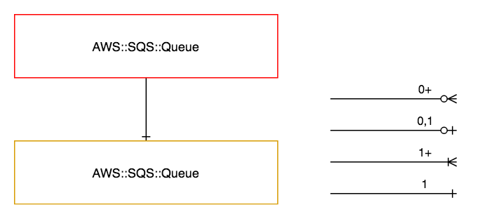

===============
AWS::SQS::Queue
===============

Architectural Outcome
=====================

The component launches AWS SQS Resource.  The resource is configured according to properties and default set out below.

Quick Start
===========

.. literalinclude:: ../samples/sqs-queue-quickstart.yaml
  :language: yaml
  :caption: AWS::SQS::Queue Quick Start

Resources
=========

Queue
-----

:Naming pattern: ``Queue``
:Required: Yes
:Reference: `AWS::SQS::Queue <http://docs.aws.amazon.com/AWSCloudFormation/latest/UserGuide/aws-properties-sqs-queues.html>`_

.. table:: Available Properties
    :widths: grid

    +-------------------------------+---------------+----------+
    | Property                      | Default Value | Comments |
    +===============================+===============+==========+
    | DelaySeconds                  | 0             |          |
    +-------------------------------+---------------+----------+
    | MaximumMessageSize            | 262144        |          |
    +-------------------------------+---------------+----------+
    | MessageRetentionPeriod        | 345600        |          |
    +-------------------------------+---------------+----------+
    | ReceiveMessageWaitTimeSeconds | 0             |          |
    +-------------------------------+---------------+----------+
    | VisibilityTimeout             | 30            |          |
    +-------------------------------+---------------+----------+

Security
========

Security rules
--------------

+-----------------+------------------------------------+
| Allow Rule Name | Included Actions                   |
+=================+====================================+
| read            | - sqs:ChangeMessageVisibility      |
|                 | - sqs:ChangeMessageVisibilityBatch |
|                 | - sqs:DeleteMessage                |
|                 | - sqs:DeleteMessageBatch           |
|                 | - sqs:ReceiveMessage               |
+-----------------+------------------------------------+
| write           | - sqs:ChangeMessageVisibility      |
|                 | - sqs:ChangeMessageVisibilityBatch |
|                 | - sqs:DeleteMessage                |
|                 | - sqs:DeleteMessageBatch           |
|                 | - sqs:SendMessage                  |
|                 | - sqs:SendMessageBatch             |
+-----------------+------------------------------------+
| admin           | - sqs:PurgeQueue                   |
|                 | - sqs:SetQueueAttributes           |
+-----------------+------------------------------------+

Outputs
=======

+-----------------------+-----------------------+---------------------------------------------------------------------------------------------------------------+
| Output Name           | Description           | Sample Value                                                                                                  |
+=======================+=======================+===============================================================================================================+
| Build                 | Build number          | 1                                                                                                             |
+-----------------------+-----------------------+---------------------------------------------------------------------------------------------------------------+
| QueueArn              | Queue ARN             | arn:aws:sqs:ap-southeast-1:138500934092:demo-canary-testing-1-sqs-resources-Queue-1MAME2CCVNHWX               |
+-----------------------+-----------------------+---------------------------------------------------------------------------------------------------------------+
| QueueArnDeploymentDns | DNS Name of SQS Queue | sqs.testing-1.canary.demo.sin.auto.nonprod.c0.xyz.com                                                         |
+-----------------------+-----------------------+---------------------------------------------------------------------------------------------------------------+
| QueueName             | Queue Name            | demo-canary-testing-1-sqs-resources-Queue-1MAME2CCVNHWX                                                       |
+-----------------------+-----------------------+---------------------------------------------------------------------------------------------------------------+
| QueueUrl              | Queue Endpoint URL    | https://sqs.ap-southeast-1.amazonaws.com/138500934092/demo-canary-testing-1-sqs-resources-Queue-1MAME2CCVNHWX |
+-----------------------+-----------------------+---------------------------------------------------------------------------------------------------------------+
