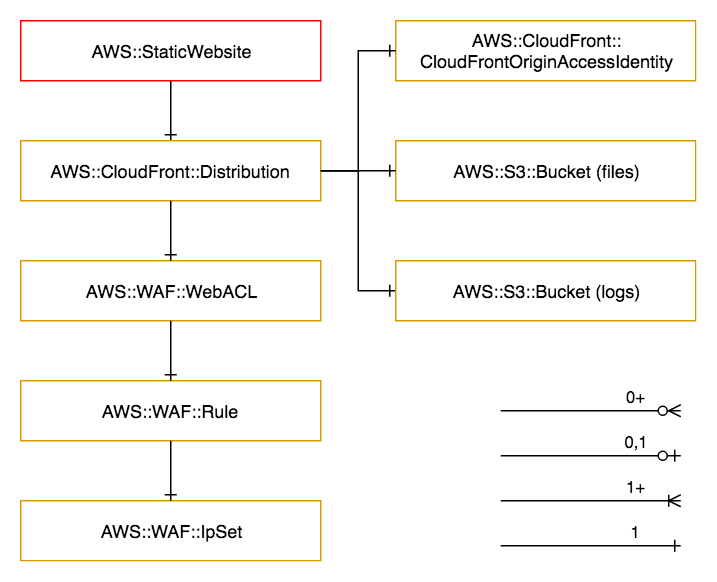

==================
AWS::StaticWebsite
==================

Architectural Outcome
=====================

This consumable deploys static website files to an S3 bucket fronted by CloudFront. It supports:

* HTTPS access
* Custom domains
* IP whitelisting

Lifecycle
=========

.. CAUTION::
   Deployment will perform an immediate in-place update. This is different to the standard blue/green deploy-release lifecycle.

Due to the long creation and update time for CloudFront and WAF resources, this consumable performs a **live update** to existing endpoints during deploy. This is different to the standard blue/green deploy->release->teardown lifecycle.

Any changes should therefore be first thoroughly tested on a new temporary branch.

Quick Start
===========

.. literalinclude:: ../samples/staticwebsite-quickstart.yaml
  :language: yaml
  :caption: AWS::StaticWebsite Quick Start

Resources
=========

CloudFront Distribution
-----------------------

:Naming pattern: ``Distribution``
:Required: Yes
:Reference: `AWS::CloudFront::Distribution <https://docs.aws.amazon.com/AWSCloudFormation/latest/UserGuide/aws-resource-cloudfront-distribution.html>`_

.. table:: Available Properties
    :widths: grid

    +----------------------+----------------+-----------------------------------------------------------------------+
    | Property             | Default Value  | Comments                                                              |
    +======================+================+=======================================================================+
    | Aliases              |                | - The same alias cannot be used by multiple branches at the same time |
    |                      |                | - Ensure feature branches use unique aliases                          |
    +----------------------+----------------+-----------------------------------------------------------------------+
    | CacheBehaviors       |                |                                                                       |
    +----------------------+----------------+-----------------------------------------------------------------------+
    | CustomErrorResponse  |                |                                                                       |
    +----------------------+----------------+-----------------------------------------------------------------------+
    | DefaultCacheBehavior |                | Required                                                              |
    +----------------------+----------------+-----------------------------------------------------------------------+
    | DefaultRootObject    | index.html     |                                                                       |
    +----------------------+----------------+-----------------------------------------------------------------------+
    | PriceClass           | PriceClass_All |                                                                       |
    +----------------------+----------------+-----------------------------------------------------------------------+
    | ViewerCertificate    |                |                                                                       |
    +----------------------+----------------+-----------------------------------------------------------------------+

Security
========

Encryption
----------

Default AES256 encryption is enabled for the S3 bucket. Note that KMS cannot currently be used as CloudFront does not support KMS-encrypted buckets.

See `Amazon S3 Default Encryption for S3 Buckets <https://docs.aws.amazon.com/AmazonS3/latest/dev/bucket-encryption.html>`_.

Outputs
=======

+-------------+--------------------------------------+---------------------------------------------------------+
| Output Name | Description                          | Sample Value                                            |
+=============+======================================+=========================================================+
| Dns         | Public DNS Record for static website | web.testing.staticweb.demo.sin.auto.nonprod.pc0.xyz.com |
+-------------+--------------------------------------+---------------------------------------------------------+
