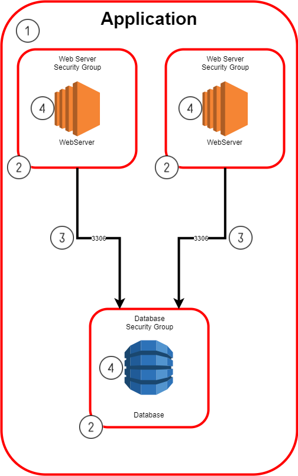
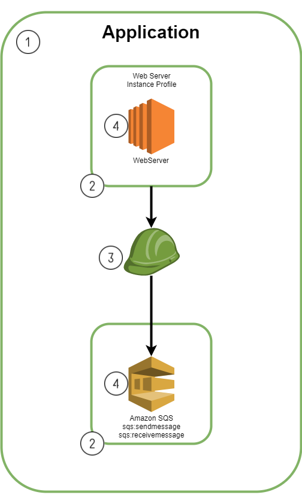
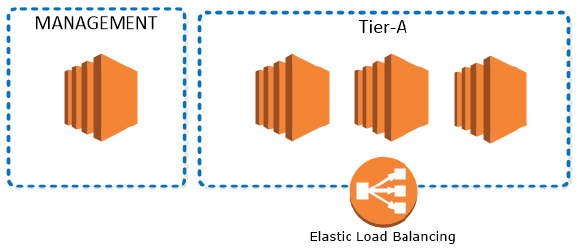
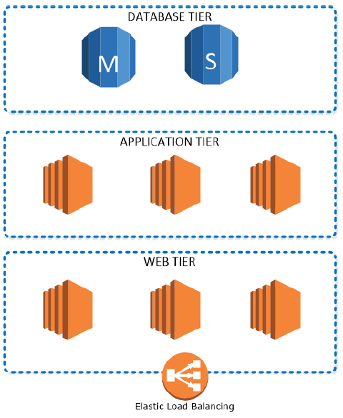
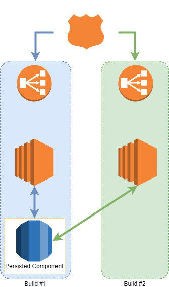

==============================
Describing your infrastructure
==============================

.. _components:

Components
==========

An application is made up of one or more components. Each component represents a group of infrastructure resources which you can configure and link together to build your application.
For example, consider this 'AWS::Instance' component which represents a simple single EC2 instance.

.. code-block:: yaml

    instance:
      Type: AWS::Instance
      DependsOn: database

      Configuration:
        Instance:
          Metadata:
            AWS::CloudFormation::Init:
              config:
                packages:
                  yum:
                    python36: []
                files:
                  /home/ec2-user/message.json:
                    source:
                      Fn::Pipeline::FileUrl:
                        Path: "message.json"
          Pipeline::Security:
            - Allow: TCP:22
              Source: bastion
          Properties:
            ImageId:
              Fn::Pipeline::ImageId:
                Name: amazon-linux-latest
            InstanceType: m3.medium
            SubnetId:
              Fn::Pipeline::SubnetId:
                NetworkZone: private


The various properties of a component definition are introduced below. Note that there are some additional advanced properties available which will be covered separately later in the documentation.

Type
====

The 'Type' property specifies the type of component to be launched, for example "AWS::Autoscale", "AWS::Instance", "AWS::RDS::MariaDB", "AWS::SQS::Queue". In this case, "AWS::Instance" will provision a simple EC2 instance.
A list of component types and details about these component types are found in the Component Reference section.

DependsOn
=========

When your application grows to more than one component, you will likely want to control the order in which your components are deployed. The 'DependsOn' property lets you control this ordering. For
example, if you have two components:

  - **my-database**: an RDS database component
  - **my-app**: an autoscaled application component

You will likely want the database to be built before the application so that the application can immediately connect to the database. To achieve this, you could set my-app component's **'DependsOn'** property to **'my-database'**. The pipeline will then build the components in order of the dependencies specified (e.g., database first, then the application).

Persist
=======

Persistence is an important concept in the pipeline. It allows you to control the lifecycle of individual components within your application. For example, if you have an autoscaled application and a database, and want to rebuild the application component but want to keep the database, you would persist the database. Your next build would then rebuild the application component, but continue to use the existing database instead of deploying a new one.  The **'Persist'** property lets you control the persistence of this component.

Configuration
=============

The majority of your configuration will be performed in the Configuration section. This section allows you to configure your component resources to suit your application requirements. In the example above, we configured a resource of type **AWS::Instance** to be an **m3.medium** instance running on the latest Amazon Linux SOE image.
Different components have different configuration options. Once you understand the basics of pipeline operation, take a look at the Consumables Reference section to find out about available components and their configurations.

Component Definition Specification
==================================

.. code-block:: yaml
    :caption: Component definitions are written in YAML with the following format

    <component name>:
      Type: <component type>
      DependsOn: <component name to depend on>
      Persist: <true|false>

    Configuration:
      <resource name>:
      Pipeline::Security:
        - Allow: [ <resource ingress rules> ]
          Source: <source security item>
      Properties:
        <resource property>: <resource value>

Some properties are defined at component level, while others are defined per resource.

+----------------------------+--------------------------------------------------------------------------------------------------------------+
| Component level properties |                                                                                                              |
+============================+==============================================================================================================+
| Type                       | Type of component to be launched. See Component Reference.                                                   |
+----------------------------+--------------------------------------------------------------------------------------------------------------+
| DependsOn                  | Name of the dependent component to manage deployment order. If unspecified, components are built in parallel |
+----------------------------+--------------------------------------------------------------------------------------------------------------+
| Persist                    | Persistence toggle of this component.                                                                        |
+----------------------------+--------------------------------------------------------------------------------------------------------------+

+---------------------------+---------------------------------------------------------------------------------------------------------------------------------------------------------------------------+
| Resource level properties |                                                                                                                                                                           |
+===========================+===========================================================================================================================================================================+
| Pipeline::Security        | Defines component-to-component security within this application.                                                                                                          |
+---------------------------+---------------------------------------------------------------------------------------------------------------------------------------------------------------------------+
| Properties                | Configuration properties of the resource.  These correspond very closely with CloudFormation properties. See individual component type references in Component Reference. |
+---------------------------+---------------------------------------------------------------------------------------------------------------------------------------------------------------------------+

Facts: Context and Vars
=======================

There are two types of variables you can use to input dynamic values into your components: ``context`` and ``vars``.

For details on vars, see :ref:`Repository directory structure <variables>`.

``context`` is provided by your "facts" files - maintained in their own repository (typically ``$client-config``). They provide values that are controlled by the cloud team, and the application developers can reference them, most commonly for ``context.Portfolio``, ``context.App``, ``context.Branch``, and ``context.Build``.

Usage of the two is similar, as seen in this Serverless component:

.. literalinclude:: ./samples/serverless-quickstart.yaml
  :language: yaml
  :caption: AWS::Serverless Quick Start

.. code-block:: yaml
    :caption: An example data structure for "context", incomplete

    context:
      Account: prod-auto
      App: myapp
      Branch: master
      BranchShortName: master
      Build: '1'
      Environment: prod
      NameServers:
        - 10.118.126.4
        - 10.118.126.20
        - 10.118.126.36
      Portfolio: myportfolio
      ProxyUrl: http://proxy.sin.services.prod.c0.sq.com.sg:3128
      TrendMicroDsmUrl: dsm.prod.trendmicro.coreservices.sin.services.prod.c0.myclient.com

To get the full list of context vars available, take a look at your facts repo. There are two files of interest:

* accounts.yaml: per-environment facts
* apps.yaml: per-app facts

"accounts" and "apps" values are merged together when the pipeline compiles your application, based on the branch name.

.. code-block:: yaml
    :caption: An example data structure for apps.yaml

    prn:myportfolio:myapp:*:*:
      Account: nonprod-auto
      Region: sin
      Tags:
        Foo: nonprodbar
    prn:myportfolio:myapp:master:*:
      Account: prod-auto
      Region: sin
      Tags:
        Foo: prodbar

apps.yaml tells the compiler which accounts facts to merge in (typically nonprod or prod facts), and they are then made available to your component's yaml files via ``context``.


Component Security
==================

Security Linking
----------------

Security access between components within the same application is controlled and managed by the pipeline.  Required rules are updated and constructed per build, allowing changes with each application iteration.
Examples below demonstrate how the IP and IAM rules get constructed:

  1. Application-level security Groups are built
  2. Component level security principles (Profiles and Groups) are built
  3. Security linking between component security principles, rules and policies is established
  4. Components are launched and linked to individual security principles (Profiles and Groups)






Defining security rules for components
--------------------------------------

Component-to-component security is configured with **Pipeline::Security** property of component definition file:

  - The Pipeline::Security property is an **array** of rules.
  - Security is always defined on the **ingress** of a resource.

Each security rule in the array must include Source and Allow sub-properties.

Source
------

**Source** sub-property specifies the security item for which we want to configure access to the current component. Security items are referenced in the format **<component name>**. In the example above, the AWS::Instance component produces a security item named SecurityGroup. The my-database component then references this security item by setting the Source property to my-instance. This establishes the flow from my-instance to my-database over port TCP:3306.

Allow
-----

**Allow** sub-property defines the level of access given to the Source security item. In the example above, the **my-instance** security item will be allowed to access the my-database component only on TCP port 3306.  The individual component types reference documentation will list the details of each produced security items.

IP Access
---------

IP access can be specified in a few formats:

  - **<protocol>:<port>** - single-protocol single-port (eg: TCP:80)
  - **<protocol>:<from_port>-<to_port>** - single-protocol port-range (eg: TCP:8080-8081)
  - **ALL:*** - all-protocols all-ports
  - The Allow property can also be an array of IP access rules in any of the formats above, eg: [ "TCP:80" , "TCP:443", "TCP:8080-8081"]

IAM Access
----------

IAM access is configured by specifying component security aliases as outlined in the individual component documentation, eg:

.. code-block:: yaml

  - Allow: [ read, write, delete ]
    Source: lambda

IP Access Example
`````````````````

The example below demonstrates IP security linking between components. (Notice the component name used as the security principle is derived from the YAML file name)

  - The database (my-database) Security property is specifying that the Source (my-instance) is allowed to access this resource (DBInstance)

.. code-block:: yaml
    :caption: my-instance.yaml

    my-instance:
      Type: AWS::Instance
      DependsOn: my-database

      Configuration:
        Instance:
          Properties:
            ImageId:
              Fn::Pipeline::ImageId:
                Name: amazon-linux-latest
            InstanceType: m3.medium
            SubnetId:
              Fn::Pipeline::SubnetId:
                NetworkZone: private

.. code-block:: yaml
    :caption: my-database.yaml

    my-database:
      Type: AWS::RDS::MariaDB
      Persist: true

      Configuration:
        DbInstance:
          Pipeline::Security:
            - Allow: TCP:3306
              Source: my-instance
          Properties:
            AllocatedStorage: 20
            DBInstanceClass: db.t3.medium

IAM Access Example
``````````````````

The example below demonstrates IAM security linking between components. (Notice the component name used as the security principle is derived from the YAML file name)

  - The dynamo Pipeline::Security property is specifying that the Source (lambda) is allowed to access this resource (AWS::DynamoDB)

  .. code-block:: yaml
      :caption: lambda.yaml

      lambda:
        Type: AWS::Serverless
        Persist: false

        Configuration:
          Function:
            Properties:
              Code:
                S3Key:
                  Fn::Pipeline::FileS3Key:
                    Path: dynamo-writer-lambda.zip
              Handler: main.handler
              MemorySize: 128
              Runtime: python3.6
              Timeout: 3

.. code-block:: yaml
    :caption: dynamo.yaml

    dynamo:
      Type: AWS::DynamoDB
      Persist: true

      Configuration:
        Table:
          Pipeline::Security:
            - Allow: [ read, write, delete ]
              Source: lambda
          Properties:
    ...

Sequencing
==========

DependsOn
---------

If an application consists of multiple components which are interacting with each other (e.g., an EC2 instance and an RDS database), it is often desirable to control the order in which these components are deployed. This becomes especially important when one component requires outputs of the deployment of another component, as is the case with an application instance requiring the database endpoint URL, for example.  The pipeline allows deployment to be ordered through the DependsOn property inside your component definitions. Components are deployed based on their dependencies. This has two outcomes:

  1. Components without any dependencies or with the same dependencies are deployed in parallel
  2. Components with dependencies will not begin deploying until all dependent components have completed

Example: Single-tier application with two components
````````````````````````````````````````````````````

Consider an application with two components. These two components do not require knowledge of one another, and so can be launched in parallel:



.. code-block:: yaml
    :caption: Single Tier Application

    # tier-a.yaml
    tier-a:
      Type: "AWS::AutoScale"
      Persist: false

      Configuration:
        BakeInstance:
    ...

    # management.yaml
    management:
      Type: "AWS::Instance"
      Persist: false

      Configuration:
        Instance:
    ...

These definitions would result in both components being launched in parallel at the same time.

Example: Multi-tier application with three components
`````````````````````````````````````````````````````

Consider a three-tier application consisting of a web tier, an application tier, and a data tier:



You would likely require your application to have knowledge of the database endpoints, username, and password. Similarly, you would likely require your web tier to have knowledge of the application tier's endpoint and port settings.
This can be achieved by specifying **DependsOn** between each tier.

.. code-block:: yaml
    :caption: Three Tier Application

    # my-database.yaml
    my-database:
      Type: AWS::RDS::MariaDB
      Persist: true

      Configuration:
        DbInstance:

    ...

    # app-tier.yaml
    app-tier:
      Type: "AWS::Autoscale"
      DependsOn: my-database
      Persist: false

      Configuration:
        BakeInstance:

    ...

    # web-tier.yaml
    web-tier:
      Type: "AWS::AutoScale"
      DependsOn: app-tier
      Persist: false

      Configuration:
        BakeInstance:

    ...

This configuration builds the my-database component first, the app-tier component second, and the web-tier component last, one after the other.


Persistence
===========

Persist Property
----------------

Persistence of components can be defined on per component basis with the **Persist** property. If **Persist** flag is set to true then the component is not torn down along with the rest of the application stack during the Teardown action:

  - Only components in the Released state can be made persistent.
  - Persist flag can be turned on and off per build, which means that if a component were made persistent in Build #1 it would persist to Build #2.
  - Persist property is set to false as default for all components.

Use Cases
---------

A common case of persistence is with the use of databases. Users are able to define these resources as individual components and set the Persist property to true to retain these components for subsequent builds.

Example 1: Persisted RDS Database
`````````````````````````````````

In this example, an RDS database is flagged to persist between builds. During Build#2, autoscaling component will be rebuilt, while RDS component will be re-used from the previous build.



.. code-block:: yaml
    :caption: MySQL RDS database component set to persist

    # rds-mysql.yaml
    rds-mysql:
      Type: "AWS::RDS::MySQL"
      Persist: true

      Configuration:
        Properties:
          AllocatedStorage: 10
          DBInstanceClass: db.t3.medium
          DBName: rds-mysql
          MultiAZ: false
          StorageEncryption: false

