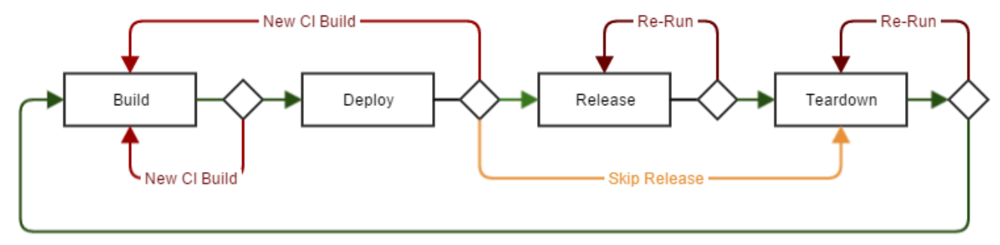

============
Introduction
============

What is the pipeline?
=====================
The pipeline is a tool for building, deploying, and managing the lifecycle of applications through a standardised and repeatable framework. It is designed to provide an accelerated self-service approach to repeatable application deployment.

What does the pipeline do for me?
=================================
The pipeline allows teams to **develop**, **build**, **deploy**, **release**, and ** teardown** applications in the cloud in a secure, standard, and repeatable manner. Behind the scenes, the pipeline performs the necessary heavy lifting including:

* **Application lifecycle** - Manages build, deploy, release, teardown, rollback phases
* **Security** - deploys, manages, and enforces application security in line with best practices and company policies
* **Governance** - enforces change control and governance requirements
* **Compliance** - enforcing company compliance requirements
* **Data Persistence** - maintains component persistence between builds, when required
* **Logging** - provides logging of configuration and events
* **SOE Enforcement** - manages and enforces the use of SOE images

By performing this heavy lifting on behalf of application teams, using the pipeline results in:

* **Increased developer agility** - developers can focus on their application rather than connecting and managing the underlying infrastructure.
* **Increased operator agility** - operators use the pipeline to perform common tasks operations in a highly standardised application lifecycle.
* **Repeatability** - The pipeline enforces automation of application deployment, infrastructure as code, and configuration as code.
* **Recoverability** - By enforcing everything-as-code and enforcing best practice architecture patterns, application teams can be confident in their ability to restore data and systems in the event of a disaster.
* **Reduced risk** - Through a high degree of automation, the pipeline reduces the requirement for human intervention and the potential for human error during application deployment.
* **Stronger governance and compliance** - The pipeline transparently manages the governance and compliance aspects of deployment. Applications deployed through the pipeline are assured of complying with company requirements.

Infrastructure-as-Code
======================
In the pipeline, infrastructure is described as discrete groupings of resources known as *components*. Components are defined and configured by the application teams in YAML files known as component definitions. Below is an example of a basic component definition that would result in a single EC2 instance being deployed based on an Amazon Linux SOE:

.. code-block:: yaml
    :caption: Example component definition

    instance:
      Type: AWS::Instance

      Configuration:
        Instance:
          Properties:
            ImageId:
              Fn::Pipeline::ImageId:
                Name: amazon-linux-latest
            InstanceType: t3.small

An application can consist of one or more components. Security between components is defined in the component definition. For example, a simple three-tier application would be described with three components:

.. image:: /images/three-tier-app.png
    :width: 70%
    :align: center

In this example, the application repository will contain three component definition YAML files: two Autoscale components and one MySQL component.

When deploying your application, the pipeline will read these component definitions and create all of the necessary resources as configured in the definitions - including installing and configuring your application.
