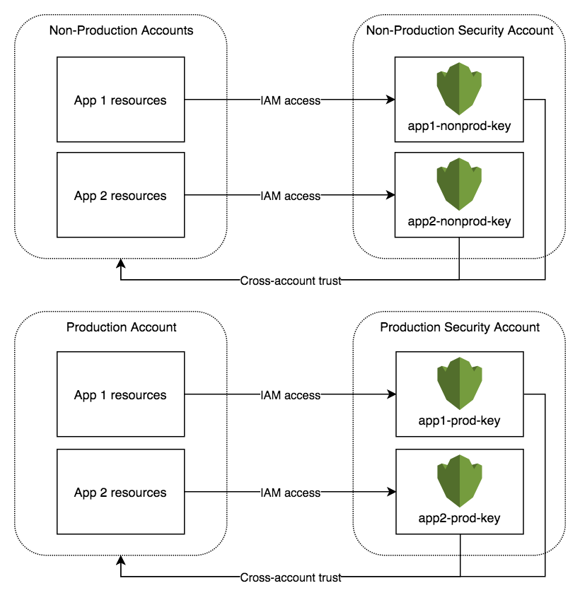

========
KMS Keys
========

Encryption at rest is a non-negotiable requirement for customer data and good security practice for all other types of data.

For each application, we will automatically and transparently create one KMS key per deployment environment (e.g., dev, uat, prod). The KMS key is created on the first deployment of the application into a given environment. It will be available for use by all components in all branches and builds of an application within the environment.

Usage
=====

Default Encryption
------------------

Consumables automatically use the created KMS keys for encryption at rest and transit where this configuration is supported by the AWS service.

Application Secrets
-------------------

The KMS key can be used by components to perform encryption and decryption of application secrets. The key id can be retrieved from a number of sources:

* PIPELINE_KMS_KEY_ARN environment variable
* pipeline.KmsKeyArn in context.yaml and context.json
* pipeline_KmsKeyArn in context.sh

To support this, components in an application will be given Encrypt, Decrypt, and Grant permissions to the KMS key in the deployment environment by default.

Key Storage
===========

KMS Keys are created in a secured account and delegated to application accounts, as shown in the diagram below:

