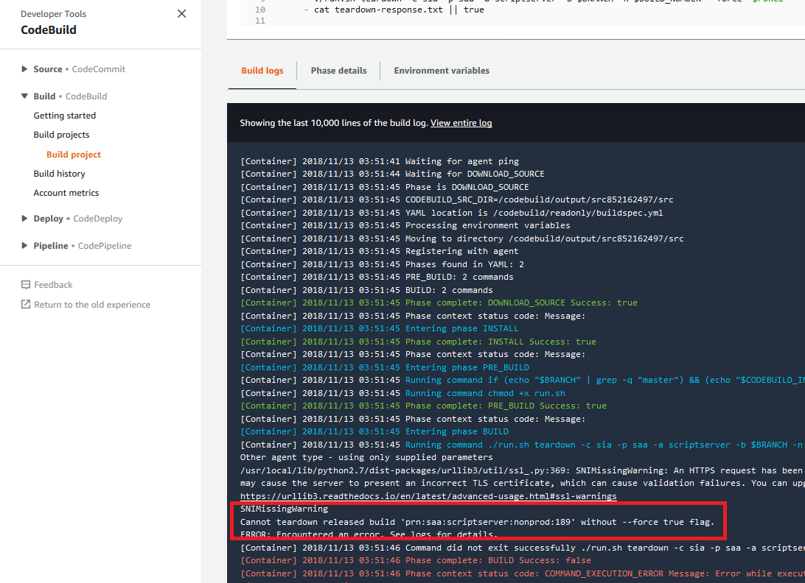
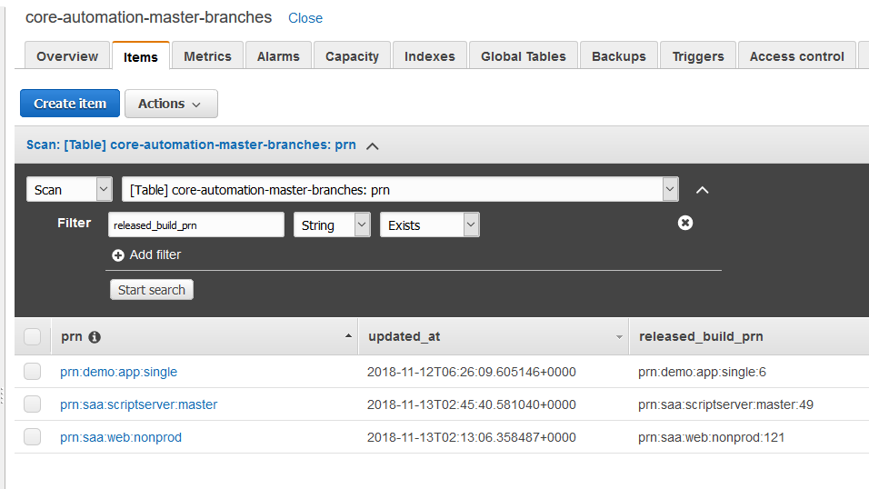
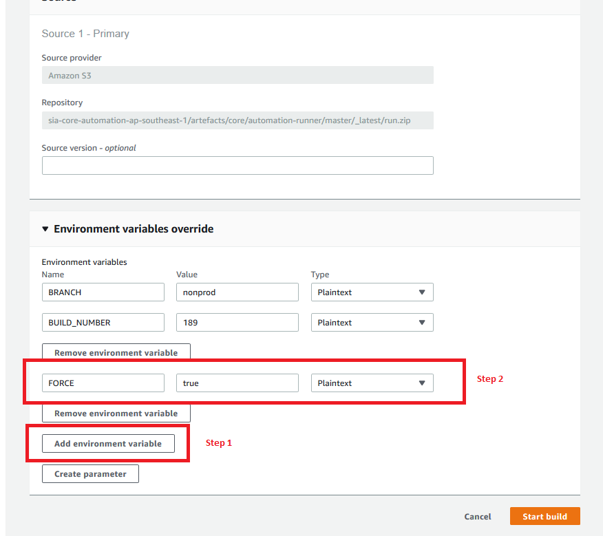

=======================================
Teardown Protection for Released Builds
=======================================

Overview
========

Tearing down builds is currently handled via CI, such as a CodeBuild project - for example: ``demo-app-teardown``.

To teardown a build, you specify the branch and build number.

We can limit who can teardown master to specific IAM Roles, but even then, there's the chance of a "fat fingers" incident, where the current production build is torn down by accident, causing downtime.

The core automation platform now has a "teardown protection" feature added for all appspec projects. If you try to teardown the released build, you'll see something like this:

How does it work?
=================

The pipeline has the capability to report status updates during various lifecycle updates. This data gets reported to Dynamodb table/property ``core-automation-master-branches.released_build_prn``:

Note: This gets reported when you start releasing a build, meaning if the release fails,  it will point to the failed release.

What if I really need to tear that build down?
==============================================

Example: I have a feature branch, with only one build, and its the released build, and I want to tear it down.

In your CI tool (e.g CodeBuild), add ``FORCE=true`` environment variable when starting your teardown job:

This adds `--force "true"` to the run.sh invocation, which will allow the teardown to continue.